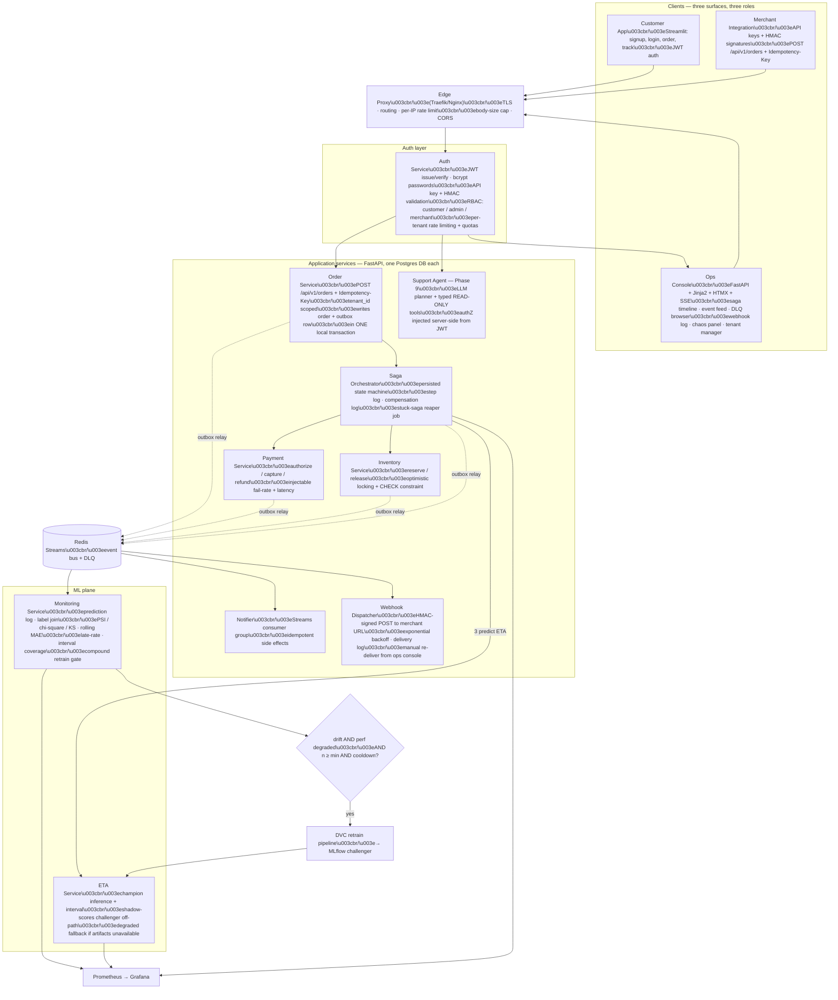
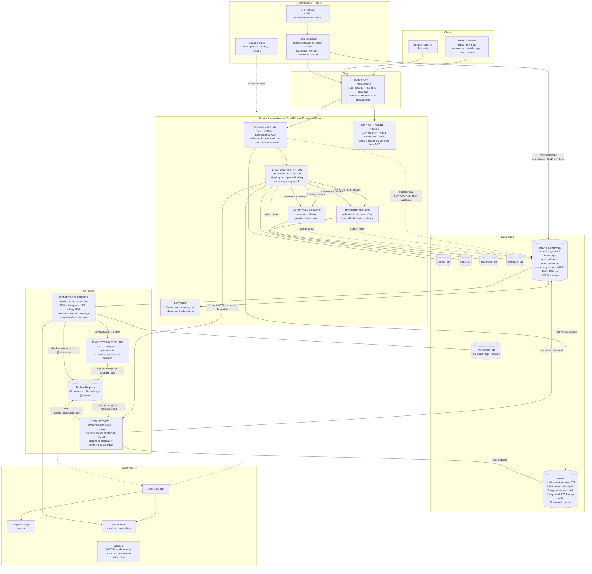
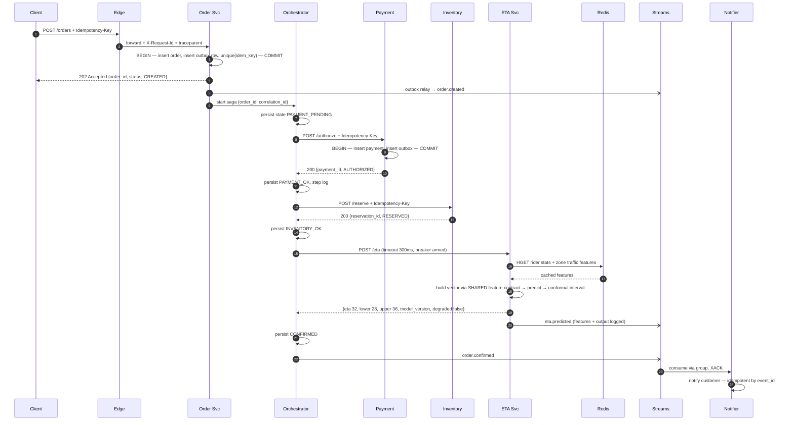
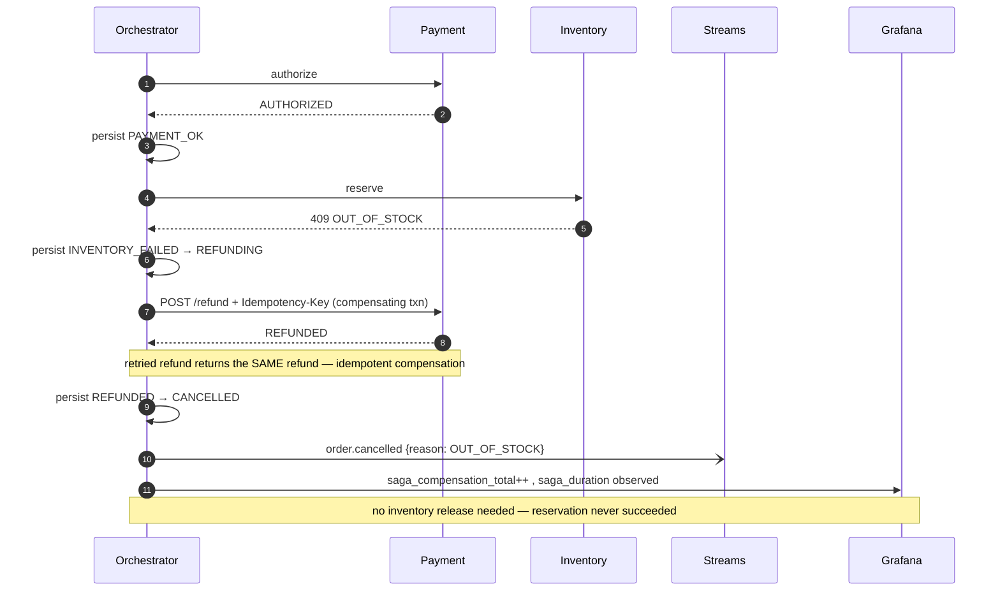
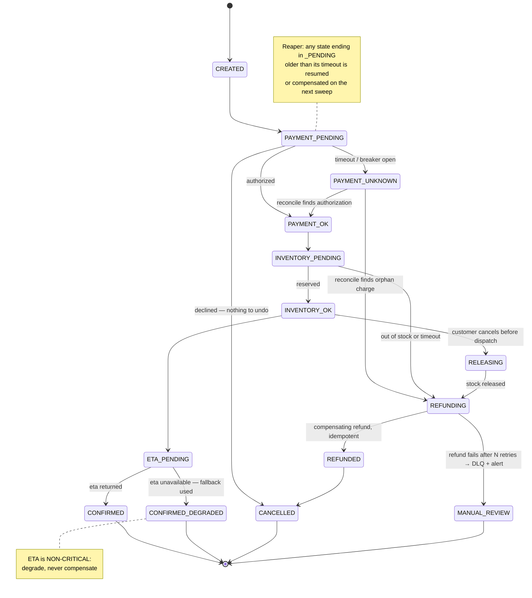
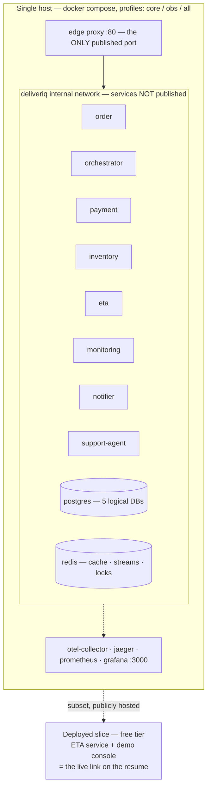

# DeliverIQ — Implementation Plan

**From**: `delivery-time-prediction` (a trained model with a demo UI)
**To**: an event-driven delivery-fulfilment backend where the ML model is a first-class service, with a closed monitoring loop around it.

This is a planning document only. It contains:

1. Why this project exists (the answer to *"what's the use of building this?"*)
2. A full honest audit of the current repo — everything that must be cleaned or fixed first
3. **What we are actually building, from each user's point of view, and what every screen looks like** (§2.3–§2.5)
4. Phased build plan (Phase 0 → Phase 10, plus the v2 insertions 3A / 3B / 3C / 7A), each phase ending in something demoable
5. Appendices A–F: ADRs to write, metric catalogue, interview defence matrix, claim discipline, the final system design
6. **Appendices G–I: the interview pack** — every backend concept this project contains and what you must know about each, a one-page concept inventory, and exactly how to introduce the project and demo it

---

## Revision log

### v2 — 2026-08-20: repositioned from "an ML system with a saga" to "a backend platform that contains an ML service"

The v1 plan was strong on distributed-systems patterns and thin on the two things that actually decide fresher backend interviews.

**Problem 1 — nothing was visible.** Saga state, idempotent replay, outbox lag, DLQ contents and compensation all happened inside Postgres and Redis with no surface rendering them. In an interview, a capability you cannot *show* in fifteen seconds does not exist — and this is psychology, not fairness. The wrong fix is a prettier customer UI: a customer is never supposed to see idempotency. The right fix is an **ops console**, which is exactly how Stripe, Razorpay, Twilio and Shopify demonstrate their backends — not the checkout button, but the event log, the delivery attempts, the retry ladder, the state history. Every "invisible" thing in this project is already a row in a table or an entry in a stream. v2 renders them. → new **§2.3**, **§2.4**, **Phase 7A**.

**Problem 2 — the plan skipped the fundamentals interviewers drill hardest.** Transaction isolation levels and *where* each was chosen; index design with `EXPLAIN ANALYZE` before/after; composite-index column order; N+1 queries; connection-pool sizing and why pool size ≠ thread count; optimistic vs pessimistic locking (the inventory row is the best concurrency story in the whole project and v1 never mentioned it); and a real cache-invalidation strategy rather than "we use Redis". All cheap to add. All the difference between *"I read a microservices article"* and *"I have debugged a database"*. → new **§1.6A**, **Phase 3C**, **Appendix G**.

Two further changes:

**Problem 3 — positioning.** "Delivery time prediction" reads as an ML project, which is why the backend work was invisible in the *framing* as well as in the UI. v2 repositions the system as a **B2B fulfilment API that restaurant partners integrate with**, with the customer app as one client of it. API keys, HMAC request signing, multi-tenancy, per-tenant quotas, and signed webhooks with a delivery-attempt log then become *native features of the product* rather than resume padding — and `Idempotency-Key` stops being an obscure distributed-systems term and becomes "the same header Stripe's API takes", which every interviewer recognises instantly. → new **§0.1.1**, **Phase 3B**.

**Problem 4 — no standard backend surface.** JWT auth, bcrypt password hashing, RBAC, auth middleware, pagination/filtering/sorting, per-user rate limiting, API versioning. Understand what this is: **table stakes, not differentiation.** Every competing candidate has it, and the project fails a screening question without it. Two days of work. It must never become the centrepiece — the saga stays the centrepiece. → new **Phase 3A**.

**Deprioritised:** Phase 9 (LLM support agent) moves from *"in scope, built last"* to *"only if everything else is finished, documented and recorded"*. See the amendment to **D1**.

**Compatibility rule:** nothing in v1 was deleted. Where v2 changes a v1 statement, the v1 text is edited in place and the change is flagged `(v2)` so you can see what moved. Existing cross-references still resolve — new phases use letter suffixes (3A, 3B, 3C, 7A), so "the Phase 2 shadow hook" and "the Phase 6 gate" still mean exactly what they meant.

**Revised build order for placement season** — the v1 order (0→10, sequentially, completely) will not finish before your interviews. Build in this order instead, and stop wherever you run out of time; every stopping point is a coherent, demoable system:

| Priority | Phase | Days | Why here |
|---|---|---|---|
| 1 | 0 | 5–7 | Non-negotiable. The leakage fix alone is your best ML story. |
| 2 | 1 | 3 | Foundations everything else sits on. |
| 3 | 2 | 5–7 | Makes the ETA service genuinely yours. |
| 4 | 3 | 5–7 | The saga. The centrepiece. |
| 5 | **3A** | 2 | Table stakes. Unlocks screening questions. |
| 6 | **7A (first pass)** | 3–4 | **Highest ROI in the whole plan.** Renders the saga, idempotency, outbox and events. Build the panels you already have data for; extend later. |
| 7 | **3C** | 2–3 | The fundamentals. Cheap, and heavily asked. |
| 8 | 4 | 3 | Streams, DLQ, reclaim — and the DLQ panel makes it visible. |
| 9 | **3B** | 3 | API keys, HMAC, webhooks + delivery log, quotas. The "real API product" layer. |
| 10 | 10 (README, diagrams, **3-min video**) | 1–2 | This is what gets you *shortlisted*. Do not leave it to last-minute. |
| 11 | 5 | 3 | Prometheus + Grafana + tracing. |
| 12 | 6 | 5–7 | The closed ML loop. The differentiator, but only once the backend reads as a backend. |
| 13 | 7 | 2 | Simulator, chaos scripts, load test numbers. |
| 14 | 8 | 3 | CI. |
| 15 | 9 | — | Only if 1–14 are done. Otherwise drop it whole. |

Note the two separate problems, which are easy to conflate: **shortlisting** is won by résumé bullets + a live link + a 3-minute video (priority 10). **The interview** is won by the ops console and by being able to say *"let me show you what happens when payment succeeds and inventory fails"* (priorities 4–6).

---

## 0. The North Star

### 0.1 One-paragraph description

DeliverIQ is a **multi-tenant order-fulfilment API** that restaurant partners integrate with, plus the customer app and operator console built on top of it. Placing an order runs a distributed transaction across Order, Payment and Inventory services, coordinated by a persisted saga with compensating transactions; requests are idempotent by key, state changes are published through a transactional outbox, and partners receive HMAC-signed webhooks with a retry ladder and an auditable delivery log. The ETA is produced by a served ML model that returns a *range*, not a single number, and degrades to a data-driven fallback if it is unavailable. Every prediction is logged; when the actual delivery time lands (late, as in real life), the system compares it to what was predicted, watches feature distributions for drift, and — only when drift *and* measured performance degradation coincide — triggers the DVC retraining pipeline, shadow-tests the challenger against the champion on live traffic, and promotes it automatically if it wins on accuracy, tail-lateness and latency.

### 0.1.1 What the product *is* — positioning *(v2)*

This subsection exists because the first version of the project was positioned as "delivery time prediction", which reads as an ML project. That framing is why the backend work was invisible even to you. Read the sentence you lead with as the whole positioning decision:

> *"DeliverIQ is a fulfilment API — the thing a restaurant chain would integrate with instead of building order orchestration, payment compensation and delivery-ETA themselves. It's multi-tenant, the write APIs are idempotent, partners get signed webhooks with retries, and the ETA is served by an ML model with a monitoring loop around it."*

Three parties use the system, and keeping them distinct is what makes each screen obvious:

| Party | What they are | What they touch | What they must never see |
|---|---|---|---|
| **Merchant** (restaurant partner) | The paying customer of the API. A *tenant*. | `POST /api/v1/orders` with an API key + HMAC signature + `Idempotency-Key`; receives webhooks; reads their own orders only | Any other tenant's data, ever |
| **End customer** (diner) | Places an order through the merchant's app | Signs up, logs in (JWT), places an order, sees live status, reads their own paginated order history | Other customers' orders; anything operational |
| **Operator** (you, on call) | Runs the platform | The **ops console** — saga timelines, event feed, DLQ, webhook deliveries, tenant quotas, chaos toggles | — (this is the privileged surface; RBAC `admin` only) |

The single most important consequence: **the interesting engineering is operator-facing, so the operator surface is the deliverable you demo.** That is why Phase 7A exists and why it outranks almost everything else in the revised build order.

### 0.2 Why this is a real problem (not a portfolio exercise)

This is the part that answers *"why would anyone build this?"*, and it should be in the README, because it is verifiably what the industry actually does:

| Business fact | Engineering consequence | Where it shows up in DeliverIQ |
|---|---|---|
| A wrong ETA costs money — too low ⇒ complaints and support tickets, too high ⇒ cart abandonment | Lateness must be penalised harder than earliness; a point estimate is not enough | Asymmetric loss + prediction intervals (Phase 2) |
| Traffic, weather and rider supply shift constantly | A model trained once silently rots; you need to *measure* it, not trust it | Drift + performance monitoring, gated retraining (Phase 6) |
| Money moves before goods are confirmed | You cannot hold a DB transaction across services; you need business-level undo | Saga + compensating transactions (Phase 3) |
| The ETA model is a dependency, not the app | A model outage must not stop orders | Graceful degradation + circuit breaker (Phase 2/4) |
| Ground truth arrives 30–45 min after the prediction | Monitoring must work with *delayed labels* | Two-tier monitoring: unlabelled drift now, performance later (Phase 6) |

Industry references to cite when defending the design (read these; they are your ammunition):

- DoorDash moved from quantile loss to a **custom asymmetric MSE** for ETA precisely because "a late delivery is X times worse than an early one", and validated with a two-week **shadow deployment** before an experiment — [Improving ETA Prediction Accuracy for Long-tail Events](https://careersatdoordash.com/blog/improving-eta-prediction-accuracy-for-long-tail-events/)
- DoorDash's newer ETA work outputs **probabilistic forecasts** and checks calibration with PIT histograms — [Improving ETAs with multi-task models and probabilistic forecasts](https://careersatdoordash.com/blog/improving-etas-with-multi-task-models-deep-learning-and-probabilistic-forecasts/)
- Swiggy decomposes ETA into **four legs** (order→assignment, first mile, wait time, last mile) with real-time restaurant/system stress features — [How ML powers "when is my order coming?"](https://bytes.swiggy.com/how-ml-powers-when-is-my-order-coming-part-ii-eae83575e3a9)

Your project is a scoped, honest version of that shape. That framing is what separates it from "I built a CRUD microservices demo".

### 0.3 Non-goals (deliberate, and you must be able to defend each)

| Excluded | Reason to give |
|---|---|
| Kubernetes / multi-region | ~9 services on one host *(v2: was 6, plus auth, webhook dispatcher, ops console)*. Compose matches the real operational need; I can explain how this maps to K8s but I won't pretend I operated a cluster. |
| Kafka | Redis is already in the system for cache and state. Redis Streams gives consumer groups, acknowledgement and replay-by-ID without a second piece of infrastructure. Events are coordination here, not the system of record. ([comparison](https://dev.to/young_gao/real-time-event-streaming-kafka-vs-redis-streams-vs-nats-in-2026-34o1)) |
| Real payment gateway | The interesting part is transaction semantics and failure handling, not a PSP SDK. Payment is a stub with an injectable failure/latency mode. |
| Deep learning ETA model | The existing stacking ensemble is a fine baseline; the differentiator is the serving + monitoring loop, not a bigger model. |
| A second ML model for "infra anomaly detection" | No real training data, no validation set, no way to evaluate it. It would be a demo prop. |
| Hand-rolled API gateway | An edge proxy (Traefik/Nginx) does routing and rate limiting. Writing my own is re-implementing a reverse proxy. |
| A polyglot service (e.g. Go notifier) | Go would genuinely suit the stream consumer, but one toolchain bought depth instead of breadth. I can explain the trade-off; language choice is not the interesting decision here. |
| An at-dispatch ETA model | The feature contract is designed so a second leg could slot in, and I can describe Swiggy's leg-wise decomposition — but I chose to make one prediction moment correct rather than two approximate. |
| *(v2)* An OAuth2 / OIDC identity provider | I issue and verify my own JWTs for first-party clients and use API keys with HMAC signing for server-to-server. Running an IdP (Keycloak, Auth0) is buying a product, not learning a concept; I can explain the authorization-code + PKCE flow and when I would switch to it (third-party apps acting on a user's behalf), but there are no third-party apps here. |
| *(v2)* Real billing / payment collection from merchants | Usage metering and quota enforcement are built because they are backend concerns (counters, windows, atomicity, 429s). Invoicing and a payment processor are commerce, not engineering. |
| *(v2)* Schema-per-tenant or database-per-tenant isolation | Shared schema with a mandatory `tenant_id` on every table and every query, enforced by a base repository and a test that fails any query lacking a tenant predicate. I can explain the three isolation models and their trade-offs (blast radius, migration cost, noisy neighbours, per-tenant restore) and why shared-schema is right at this scale. Postgres RLS is the natural next step and is written up as an ADR. |
| *(v2)* A separate frontend SPA with a build pipeline | The ops console is server-rendered (FastAPI + Jinja2 + HTMX) with SSE for live updates. No Node toolchain, real URLs, deep-linkable. The interesting work here is backend; a React build step would add ceremony and zero signal. |

Write these into `docs/adr/` as *rejected* options. Interviewers weight "why not X" answers heavily.

### 0.4 Honesty rule (non-negotiable)

There is no live traffic. Traffic comes from a **simulator** that replays the Kaggle Swiggy dataset as an order stream and can inject drift on demand. Say that out loud, in the README, before anyone asks. The simulator is a *test harness*, and having a deliberate, controllable one is a strength — it is what makes the drift and compensation stories demonstrable in 60 seconds instead of hypothetical.

---

## 1. Audit: what is wrong today, and what must be cleaned or fixed

Everything below was verified against the current working tree. Phase 0 fixes all of it. Nothing new gets built on top of these.

### 1.1 Bugs that break in production right now

| # | Issue | Where | Fix |
|---|---|---|---|
| 1 | **Serving-time row dropping** → 500 on valid input. `perform_data_cleaning` drops minors (`age < 18`), `ratings == 6`, and ends in `.dropna()`. On a single-row request, one unparseable or edge-case field yields an **empty DataFrame**, then `model_pipe.predict(...)[0]` raises `IndexError`. | `app.py:131-133`, `scripts/data_clean_utils.py:38-48,202` | Split cleaning into **training-time filtering** and **serving-time normalisation**. Serving never drops rows — it validates at the edge and returns a typed 422. |
| 2 | **Broken API container.** `Dockerfile` copies `models/preprocessor.joblib` but never `models/model.joblib`, which `app.py` loads at import. The image cannot start. | `Dockerfile:22-25` vs `app.py:86-87` | Copy or fetch both artifacts; add a container `HEALTHCHECK`; smoke-test the image in CI. |
| 3 | **Server binds `127.0.0.1`** inside the container → unreachable from outside even once it starts. | `app.py:139` | Bind `0.0.0.0`, port from config. |
| 4 | **`dagshub.init()` + `set_tracking_uri()` at import time** in the serving path — a network call on cold start; the app fails or hangs without credentials. Also hardcodes `repo_owner='maverick011'`. | `app.py:16-23` | Remove tracking-server calls from the serving path entirely. Artifacts are resolved at startup in a `lifespan` handler, from config. |
| 5 | **MLflow 3 API removals.** `client.transition_model_version_stage()` and `get_latest_versions(stages=[...])` were deprecated in MLflow 2.9 and **removed in MLflow 3.x**. `uv.lock` pins **mlflow 3.10.1**, so the last DVC stage and the promote script are broken today. | `src/models/register_model.py:70-80`, `scripts/promote_model_to_prod.py:29-40`, `tests/test_model_perf.py`, `tests/test_model_registry.py` | Migrate to **aliases**: `client.set_registered_model_alias(name, "champion", version)` and load via `models:/<name>@champion`. Use version **tags** for status. ([migration guidance](https://mlflow.org/docs/latest/ml/model-registry/workflow/)) |
| 6 | **No error handling, no health endpoints, no response contract.** `/predict` has no try/except, returns a bare NumPy float, no model version, no request id, no `/health`, no `/ready`. | `app.py:100-135` | Typed response model, exception handlers → RFC-7807-style errors, `/health` (liveness) and `/ready` (artifacts loaded), `/version`. |
| 7 | **Weak input schema.** Age, ratings and `multiple_deliveries` are `str`; lat/long unbounded; free-text where the encoder expects fixed categories. | `app.py:26-45` | Pydantic v2 with `Field` bounds, `Literal`/`Enum` categories generated from the same source as the encoder categories, explicit `schema_version`. |
| 8 | Dead code: `MlflowClient()` constructed and never used; `load_model_information` defined and never called. | `app.py:49-53,79` | Delete. |

### 1.2 ML-engineering problems (these are the highest-value fixes)

| # | Issue | Why it matters |
|---|---|---|
| 9 | **Feature availability leakage — the headline finding.** `pickup_time_minutes` = `order_picked_time − order_time`. At checkout, the order has not been picked up yet, so **this feature does not exist at prediction time**. `multiple_deliveries` (rider's concurrent orders) is only known after rider assignment. The current model is trained on information the caller cannot have. | This is the single most important thing to fix, and the best interview story in the project. Fix by **naming the prediction moment**: an *at-cart* model using only order-time-available features, and (optionally) an *at-dispatch* model that may use pickup/rider features. This is exactly Swiggy's leg-wise decomposition, scoped down. Expect the MAE to get worse — that is the *honest* number. |
| 10 | **No shared feature contract.** Column lists and category orders are duplicated in `app.py:63-76` and `src/features/data_preprocessing.py:17-38`. They will drift apart. | One versioned `contracts/features.py` imported by both training and serving; a parity test asserting the same raw input produces byte-identical feature vectors through both paths. |
| 11 | **Random train/test split on temporally ordered data.** `Data_Preparation.random_state: 42` with a random 25% split, while `order_date` exists. | Optimistic, leaky evaluation. Add a **time-based split** and report both numbers. |
| 12 | **Point prediction only, symmetric loss.** MAE treats 10 min early the same as 10 min late. | Add asymmetric objective + intervals (Phase 2). This is what DoorDash explicitly changed. |
| 13 | **No promotion gate.** `evaluation.py` logs metrics; `register_model.py` registers regardless of whether the model got worse. | Nothing stops a regression reaching serving. Gate registration on threshold + comparison to champion. |
| 14 | **`cross_val_score` (cv=5, n_jobs=-1) inside the evaluation stage** re-fits the whole stacking ensemble five times on every pipeline run. | Slow pipeline, makes CI-on-PR impractical. Move CV to the experimentation notebooks; the pipeline evaluates the trained artefact and (optionally) a fast holdout. |
| 15 | **sklearn/joblib version coupling.** Artifacts are `joblib` pickles; a different sklearn at serving time can fail loudly or, worse, quietly. | Record the training environment in a model card; assert the runtime version at load and refuse to serve on mismatch. |
| 16 | **No prediction logging, no drift detection, no monitoring, no retraining trigger.** | The entire reason for Phases 5–6. |
| 17 | `.dropna()` in `data_cleaning.py` discards rows wholesale, though the notebooks explicitly compared drop-vs-impute. | Either document the decision with the numbers from that experiment, or revisit it. Free interview answer if documented, a hole if not. |

### 1.3 Reproducibility

| # | Issue | Fix |
|---|---|---|
| 18 | **A fresh clone cannot reproduce anything.** `data/` is gitignored, there are **no `.dvc` files**, and `git ls-files data` is empty — yet `data/raw/swiggy.csv` is a hashed dependency in `dvc.lock`. A DO Spaces remote is configured, but the raw input is not tracked or pushed. `dvc repro` fails immediately for anyone else. | `dvc add data/raw/swiggy.csv`, commit the `.dvc` file, `dvc push`, document `dvc pull` in the README. Verify by cloning into a clean directory. |
| 19 | `register_model` DVC stage declares no `outs`. | Emit `reports/registry.json` so the stage is a real, cache-aware node. |
| 20 | Two dependency sources: `pyproject.toml`/`uv.lock` and a hand-maintained `requirements.txt` (which omits fastapi and mlflow). Plus a duplicated copy of `scripts/data_clean_utils.py` inside `hf_deploy/`. | `pyproject.toml` per service is the single source; generate deploy requirements, never hand-edit; delete duplicated code. |

### 1.4 Configuration & security

| # | Issue | Fix |
|---|---|---|
| 21 | Hardcoded DagsHub owner/repo/URI in **five** files (`app.py`, `src/models/evaluation.py`, `src/models/register_model.py`, `scripts/promote_model_to_prod.py`, and the two registry tests). `.env` is the untouched cookiecutter template. | `pydantic-settings` config object per service, `.env.example` committed, real `.env` ignored, CI via GitHub Secrets. Zero literals of owner/URI/threshold in code. |
| 22 | Docker image runs as root, unpinned base tag, no healthcheck. | Non-root user, pinned digest, `HEALTHCHECK`, `uv sync --frozen --no-dev`. |
| 23 | No rate limiting, no body-size limit, no CORS policy, no auth of any kind. | **Two layers, and know why there are two** *(v2 — now formally Phase 3A/3B)*: the **edge proxy** does coarse, identity-free protection (per-IP request cap, body-size cap, TLS, CORS) because it can do that without a database lookup; the **application** does per-user and per-tenant quota, because "is this tenant over its 10k/day plan limit" requires knowing who the caller is, and the edge does not. JWT for customer-facing routes, API key + HMAC for merchant routes, internal routes reachable only on the compose network. This *refines* the §0.3 "no hand-rolled gateway" non-goal rather than contradicting it — the proxy still does routing; the app never does routing. |

### 1.5 Tests & CI

| # | Issue | Fix |
|---|---|---|
| 24 | **`tests/test_model_perf.py:12-17` and `tests/test_model_registry.py:8-13` point at `himanshu1703/swiggy-delivery-time-prediction`** — a different person's DagsHub repo. These tests cannot ever have passed in your setup. Anyone reading the repo sees it. | Rewrite against your own registry with config, not literals. And decide your provenance story now: *"I built this following a course project, then rebuilt the serving, monitoring and distributed-systems layers myself"* is a perfectly strong answer. Leftover pointers to someone else's account with no explanation is not. |
| 25 | `tests/test_api_endpoint.py` needs a live server on `127.0.0.1:8000` and reads gitignored raw data → unrunnable anywhere but your machine. | `fastapi.testclient.TestClient` + a small committed fixture file. |
| 26 | **No `.github/` directory at all** — there is no CI, despite the project presenting as production-ready. | Phase 8. |

### 1.6 Repo hygiene and credibility signals

| # | Issue | Fix |
|---|---|---|
| 27 | `hf_deploy/` contains a **nested `.git` with LFS objects** inside the working tree; `out.txt`, empty `local_model_dir/`, stray `__pycache__/`, `run_claude.ps1`/`run_claude.sh` at root. | Deploy target becomes a build artefact produced into `dist/` (gitignored) or a separate remote — never a nested repo in the tree. Delete the rest. |
| 28 | ~100k lines of notebooks committed in one go (10 files). Legitimate experiment history, but unreadable as a repo. | Keep 2 curated notebooks (EDA, model selection) with outputs stripped; move the rest to `notebooks/archive/` or a branch; add `nbstripout`. |
| 29 | `docs/` is untouched Sphinx cookiecutter scaffolding, `main.py` is a 102-byte stub, `Makefile` is boilerplate. | Delete or make real. Dead scaffolding reads as "generated from a template and never understood". |
| 30 | Git history: 4 commits, one titled "Update project" with 100k insertions. | From here on: conventional commits, one concern per commit, PRs with a description. Interviewers do read history. |
| 31 | README lists a tech stack but no architecture, no metrics, no limitations. | Phase 10. |
| 32 | Windows/WSL specifics: mixed line endings likely, and bind-mounted Docker volumes are slow from the Windows filesystem. | `.gitattributes` with `* text=auto eol=lf`; run compose from the WSL2 filesystem. |

### 1.6A Backend-fundamentals gaps *(v2 — the highest-value addition to this plan)*

These are not bugs in existing code; they are **decisions the plan never asked you to make**, and they are what fresher backend interviews spend most of their time on. A candidate who can talk about sagas but cannot say which isolation level their outbox relay runs at reads as someone who copied an architecture diagram. Closed by **Phase 3C**; the full study material is **Appendix G**.

| # | Gap | Why it is a gap | Where it gets decided |
|---|---|---|---|
| 33 | **No isolation-level decisions.** The plan specifies `SELECT ... FOR UPDATE SKIP LOCKED` for the outbox relay but never states the isolation level, and the two are coupled: `SKIP LOCKED` is only useful under `READ COMMITTED`, because under `REPEATABLE READ` a row that changed since the snapshot raises a serialization failure (`40001`) instead of being skipped — the very thing `SKIP LOCKED` exists to avoid. | "Why READ COMMITTED here and not SERIALIZABLE?" is a near-guaranteed question the moment you say the words *transaction* or *outbox*. Having an answer per-table, with the reason, is a large signal. | Phase 3C, ADR 17 |
| 34 | **No locking strategy on the inventory row — the best concurrency story in the project, and it was missing.** Two concurrent orders for the last unit of stock is the canonical lost-update race. The plan says "reserve + release semantics" and stops there. | This is the one place where you can demonstrate, with a repeatable test, that you understand read-modify-write races. Three defensible answers exist (atomic conditional `UPDATE`, pessimistic `FOR UPDATE`, optimistic `version` column + retry) and you must be able to compare them and name the DB-level `CHECK` constraint that makes oversell impossible regardless of application bugs. | Phase 3C, ADR 18 |
| 35 | **No index design, no `EXPLAIN ANALYZE`, no query-plan evidence.** Not one index is named in v1, though the order-history endpoint, the reaper sweep, the outbox poll and the monitoring window scan all have obvious access patterns. Composite column order and partial indexes are the two highest-leverage ideas and neither appears. | "Show me a query you made faster" is the most common concrete question in a backend interview, and the only acceptable answer is a plan before and a plan after. Free to produce, impossible to fake. | Phase 3C, `docs/performance.md` |
| 36 | **N+1 queries unaddressed, and unguarded against.** The order-history endpoint fetches orders then items per order. The saga step log, the webhook delivery list and the tenant listing have the same shape. | Everyone claims to know what N+1 is. Almost nobody has a test that fails when one is reintroduced. Having that test is the differentiator, not the definition. | Phase 3C |
| 37 | **No connection-pool sizing rationale.** Nine services × replicas × a default pool of 5–20 will exhaust Postgres `max_connections` (default 100) long before CPU is the constraint, and the failure mode looks like a mysterious hang rather than an error. | The follow-up — "why isn't pool size the same as your worker count?" — separates people who have deployed something from people who have not. Little's Law gives you a one-line answer. | Phase 3C, ADR 19 |
| 38 | **"We use Redis for caching" with no invalidation strategy.** Five distinct caches are planned (online features, degraded-ETA table, idempotency fast path, semantic cache, read cache) with five genuinely different correctness requirements, and v1 assigns a strategy to none of them. | Cache invalidation is the single most-asked caching question, and "TTL" is not an answer when one of your caches is on the idempotency path where a wrong answer means charging a card twice. | Phase 3C, ADR 20 |

### 1.7 What is genuinely good and must be preserved

Keep and build on: the 6-stage DVC pipeline; the stacking ensemble with tuned hyperparameters in `params.yaml`; the domain feature engineering (haversine distance, distance bands, time-of-day, weekend); the target power transform; MLflow tracking; the map-based Streamlit UI (it becomes a client of the API, not a copy of the model); the Docker/HF deployment experience.

---

## 2. Target architecture



### 2.1 Repository layout

Evolve this repo in place — the git history showing an ML project growing into a system is an asset. Rename the repo to `deliveriq`.

```
deliveriq/
├─ services/
│  ├─ order/            # FastAPI + Postgres + outbox
│  ├─ payment/          # stub PSP with injectable failure/latency
│  ├─ inventory/        # stock reservation + release, optimistic locking
│  ├─ orchestrator/     # saga state machine + reaper
│  ├─ eta/              # ML serving (champion + shadow)
│  ├─ auth/             # (v2) JWT + bcrypt + API keys + HMAC + RBAC + quotas
│  ├─ webhook/          # (v2) HMAC-signed dispatch + retry + delivery log
│  ├─ notifier/         # stream consumer
│  ├─ monitoring/       # prediction log, drift, retrain trigger
│  └─ support_agent/    # LLM slice — read-only tools (Phase 9)
├─ ops_console/         # (v2) FastAPI + Jinja2 + HTMX — the interview demo surface
├─ platform/            # shared INFRASTRUCTURE only — never business logic or models
│  ├─ config.py  logging.py  otel.py  http.py (retry+breaker)
│  ├─ idempotency.py  outbox.py  streams.py  errors.py
│  ├─ auth_middleware.py  tenant.py  rate_limiter.py  # (v2)
├─ contracts/           # versioned event schemas + the feature contract
├─ ml/                  # the existing DVC pipeline, moved here
│  ├─ pipeline/  features/  evaluation/  monitoring/  params.yaml  dvc.yaml
├─ ops/                 # compose files, prometheus, grafana dashboards, alerts, migrations
├─ tools/               # traffic simulator, drift injector, chaos scripts, load test
├─ ui/                  # customer-facing Streamlit app (place order, track, history)
├─ tests/               # unit / contract / integration / e2e
└─ docs/                # adr/, architecture.md, runbook.md, model_card.md, performance.md, interview_notes.md
```

**Rule for `platform/`:** infrastructure primitives only. The moment a shared DB model or business rule lands there, you have a distributed monolith and the DB-per-service claim becomes false. Be ready to say that.

### 2.2 Data store decisions (each becomes an ADR)

| Concern | Choice | Defence |
|---|---|---|
| Service data | PostgreSQL, **one logical database per service**, no cross-service joins, no shared models | Enforces the boundary. One instance locally for cost; document that production = separate clusters. Honest, not simulated. |
| Saga state | **PostgreSQL** (orchestrator's own DB) | In-flight sagas move money. Redis persistence has a durability window; a crash can lose state. Saga state also needs to be queryable and auditable. If asked "why not Redis" — this is the answer. |
| Idempotency keys | Redis (fast path) **+ a unique constraint in Postgres** (source of truth) | Redis alone can lose a key and double-charge. The DB constraint is the guarantee; Redis is the optimisation. |
| Online features | Redis hashes with TTL | Sub-ms lookups on the inference path. |
| Event bus | Redis Streams, consumer groups, `MAXLEN ~` caps, explicit `XACK`, DLQ stream | Already deployed; gives at-least-once + replay + consumer groups without a second system. Uncapped streams OOM Redis — cap them. |
| Prediction log | Postgres (monitoring service DB) | Needs joins against late-arriving actuals and window aggregation. |
| Auth data | Postgres (auth service DB). Users + API keys + tenant config. **Separate from order/saga data.** | Auth is its own service boundary — user credentials never co-locate with business data. |
| Webhook delivery log | Postgres (webhook service DB). One row per attempt. | Must be queryable from the ops console ("show me the last 10 delivery attempts for this event"). |

### 2.3 The three surfaces and what each screen looks like *(v2)*

The system has three user-facing surfaces. Keeping them distinct is what makes the architecture real, not a monolith with multiple routes.

#### Surface 1 — Ops Console (FastAPI + Jinja2 + HTMX + SSE) — **this is what you demo to the interviewer**

The ops console is the admin dashboard. It renders everything that was "invisible" in v1. It is server-rendered (no Node build step, no SPA, real URLs, deep-linkable). HTMX handles partial page updates without full reloads. SSE pushes live events.

| Panel | What it shows | What concept it proves |
|---|---|---|
| **Saga Timeline** | Per-order: every step (CREATED → PAYMENT_PENDING → PAYMENT_OK → ...) with timestamps, attempt counts, and durations. Click any order to see the full lifecycle. Compensation steps highlighted in red. | Saga orchestration + persisted state machine |
| **Idempotency Replay** | "Send same order twice" button. Shows both requests, same `order_id`, same result, order count still 1. Displays the idempotency key, cache hit/miss, original vs replayed response. | Idempotency keys — visible proof |
| **Event Feed** | Live SSE stream of all events flowing through Redis Streams. Filterable by event type. Shows `event_id`, `event_type`, `correlation_id`, `timestamp`. | Event-driven architecture — visible proof |
| **DLQ Browser** | Lists poison messages in the dead-letter queue. Each shows: original event, failure reason, attempt count. **Replay button** to re-inject after a fix. | Error handling, DLQ pattern |
| **Outbox Monitor** | Shows outbox table rows, relay lag (how far behind the relay is), publish rate. | Transactional outbox — visible proof |
| **Webhook Delivery Log** | Per-webhook: every delivery attempt with HTTP status, response time, retry number, next retry time. **Manual re-deliver button**. HMAC signature visible. | Webhooks with retry + signing |
| **Tenant Manager** | List tenants, their API keys (masked), quota usage, rate limit config, plan tier. | Multi-tenancy, quotas |
| **Chaos Panel** | Toggles: fail payments (0–100%), add latency to inventory (0–5s), kill ETA service, Redis restart. **Live compensation counter** ticking up as failures hit. | Fault tolerance, graceful degradation — visible proof |
| **DB Insights** | Shows `EXPLAIN ANALYZE` output for key queries. Before/after index comparison. Connection pool utilisation. | Backend fundamentals — visible proof |

#### Surface 2 — Customer App (Streamlit, refactored from current UI)

The existing Streamlit app, but positioned as a client of the API, not a copy of the model:

- **Signup / Login** → JWT → stored in session
- **Map** → pick restaurant + delivery location
- **Order form** → weather, traffic, vehicle, rider params → "Place Order" button
- **Order tracking** → live status updates (SSE or polling), ETA with confidence interval
- **Order history** → paginated, filterable by status, date range. `GET /api/v1/orders?page=2&limit=10&status=CONFIRMED`
- **Rate limit demo** → rapid-click the order button → 429 Too Many Requests after N hits

#### Surface 3 — Merchant API (pure HTTP, no UI)

Tested via curl/Postman/httpie. The merchant never sees a UI — they integrate server-to-server:

```bash
# Authenticate with API key + HMAC
curl -X POST https://api.deliveriq.local/api/v1/orders \
  -H "X-API-Key: merch_live_abc123" \
  -H "X-Signature: sha256=<hmac_of_body>" \
  -H "Idempotency-Key: ORD-2026-08-20-001" \
  -H "Content-Type: application/json" \
  -d '{"items": ["ITEM-1"], "total_amount": 450, ...}'

# Webhook received at merchant's URL:
# POST https://merchant.example.com/webhooks/deliveriq
# X-DeliverIQ-Signature: sha256=<hmac_of_payload>
# {"event": "order.confirmed", "order_id": "ORD-...", "eta_minutes": 24.3, ...}
```

### 2.4 What Prometheus + Grafana do here and why *(v2)*

**Prometheus** is a time-series database that scrapes metrics from your services every 15 seconds. Each FastAPI service exposes a `/metrics` endpoint (via `prometheus-fastapi-instrumentator`) that Prometheus pulls.

**Why we use it:**
- Every HTTP request is automatically tracked: count, latency histogram (p50/p95/p99), status code distribution
- Custom business metrics: `saga_completed_total{state="CONFIRMED"}`, `saga_compensation_total`, `eta_degraded_total`, `idempotent_replay_total`
- ML metrics exported from the monitoring service: `model_rolling_mae`, `feature_drift_psi{feature="traffic"}`, `interval_coverage`
- Alert rules: "if `outbox_lag > 100` for 5 minutes, fire alert" — this is how you'd get paged in production

**Grafana** is the visualization layer that reads from Prometheus and renders dashboards:

| Dashboard | Panels | What it answers |
|---|---|---|
| **System Overview** | Request rate per service, latency percentiles, error rate, saga outcome pie chart, outbox lag, DLQ depth, breaker states | "Is the system healthy right now?" |
| **ML Model Health** | Rolling MAE, late-rate, interval coverage, PSI per feature, champion vs challenger, degraded prediction rate | "Is the model still accurate?" |
| **Business Metrics** | Orders/minute, avg order value, compensation rate, most common failure reason, ETA accuracy distribution | "How is the product performing?" |

**What to say in interview:** "Prometheus + Grafana is the observability stack. Prometheus scrapes metrics endpoints every 15s and stores time-series data. Grafana renders dashboards and fires alerts. I chose this over Datadog/New Relic because it's open-source and the industry standard — same stack Uber, Swiggy, and most companies run internally."

### 2.5 How auth works — two mechanisms, and why two *(v2)*

| Mechanism | Who uses it | How it works | Why this one |
|---|---|---|---|
| **JWT (JSON Web Token)** | End customers + ops admins (browser-based) | Signup → bcrypt hash stored → login → server issues signed JWT (HS256, 15 min expiry + refresh token) → every request sends `Authorization: Bearer <token>` → middleware verifies signature, extracts `user_id` + `role` | Stateless verification — no DB lookup per request. Perfect for browser clients. |
| **API Key + HMAC** | Merchants (server-to-server) | Merchant gets an API key + secret from ops console → sends `X-API-Key` header + `X-Signature: sha256=HMAC(secret, request_body)` → server validates signature | Prevents replay attacks. No tokens to expire/refresh. Standard for API products (Stripe, Razorpay, Twilio all do this). |

Both mechanisms resolve to the same internal `AuthContext(user_id, tenant_id, role)` that is injected into every request handler. The handler never knows which auth mechanism was used — it just gets a verified context.

---

## 3. Phased plan

Each phase ends with something you can run and show. Never leave a layer half-built across phases.

---

### Phase 0 — Clean and harden what exists

Nothing new. Close every item in §1. Do this first; a saga on top of an API that crashes on a malformed body is building on sand.

**Work**

1. Repo hygiene: §1.6 (remove `hf_deploy/` nested git, `out.txt`, `local_model_dir/`, stray scripts; strip/archive notebooks; delete or complete `docs/`, `main.py`, `Makefile`; add `.gitattributes`).
2. Config: `pydantic-settings` + `.env.example`; remove all hardcoded DagsHub/MLflow literals from the five files; secrets via env only.
3. **Feature contract**: create `contracts/features.py` as the single definition of raw input schema, engineered columns, category orders and `FEATURE_SCHEMA_VERSION`. Import it from both the DVC pipeline and the API.
4. **Split cleaning** into `filter_training_rows()` (drops) and `normalise_for_inference()` (never drops), sharing all transformation logic. Serving path: validate → normalise → predict, with a typed 422 on invalid input.
5. **Fix the leakage**: define the prediction moment as *at-cart*; drop `pickup_time_minutes` and `multiple_deliveries` from the at-cart feature set; retrain; record the new (worse, honest) MAE next to the old one and explain why in the model card.
6. Add a **time-based split** alongside the random split; report both.
7. Rewrite `app.py` properly: lifespan artifact loading, typed request/response, exception handlers, `/health`, `/ready`, `/version`, bind `0.0.0.0`, sklearn version assertion at load.
8. Fix the Dockerfile: both artifacts, non-root, pinned base, healthcheck.
9. **MLflow 3 migration**: aliases (`@champion`, `@challenger`, `@previous`) everywhere; delete stage transitions; `register_model` gets a real `out`.
10. DVC: `dvc add data/raw/swiggy.csv`, commit, `dvc push`; verify `dvc pull && dvc repro` in a clean clone.
11. Tests: rewrite the three broken tests; add golden-value tests for feature transforms; add the **training/serving parity test**; move CV out of the pipeline.
12. Swap flake8 → **ruff** (+ format), add light mypy on `contracts/` and `platform/`.
13. README: state provenance and current limitations honestly.

**Done when**: a clean clone can `dvc pull && dvc repro`, `pytest` is green offline, `docker compose up eta` serves a valid prediction and a typed 422 for garbage, and no credential, owner name or threshold is hardcoded anywhere.

---

### Phase 1 — Platform foundations

**Work**

- Compose stack: Postgres (3 logical DBs) + Redis + edge proxy; profiles for `core`, `obs`, `all`.
- `platform/`: settings, **structured JSON logging** with `correlation_id`/`trace_id`, error envelope, HTTP client with timeout + retry-with-jitter + circuit breaker, Redis and Streams helpers.
- Service skeleton template: FastAPI app factory, `/health` + `/ready` (readiness = dependencies actually reachable), Alembic migrations, request-id middleware, graceful shutdown.
- `contracts/events.py`: event envelope (`event_id`, `event_type`, `event_version`, `occurred_at`, `correlation_id`, `idempotency_key`, `payload`) + versioning rules (additive-only, never repurpose a field).

**Done when**: `docker compose up` brings up all skeletons healthy, one request produces a log line in every service carrying the same correlation id, and migrations run from scratch.

---

### Phase 2 — ETA Service (the ML core, done properly)

This is the phase that makes the project *yours*. Give it the most depth.

**Work**

1. **Model loading**: resolve `models:/delivery_eta@champion` from MLflow at startup, with a bundled local artifact as an offline fallback; `/admin/reload` to pick up an alias flip without a redeploy; expose model version + feature schema version in every response.
2. **Prediction intervals.** Two options, pick one and defend it:
   - *Recommended*: **split/inductive conformal** on top of the existing ensemble — a held-out calibration set of absolute residuals, quantile recomputed on a schedule, interval generation is a constant-time lookup at inference. Distribution-free coverage, near-zero latency. ([overview](https://valeman.medium.com/conformalized-quantile-regression-smarter-uncertainty-prediction-for-data-scientists-6389bea7a7c4))
   - *Alternative*: LightGBM **quantile regression** at q=0.1/0.5/0.9, optionally conformalised (CQR) for calibrated coverage.
   Then serve `"28–36 min"` like a real app, and track **interval coverage** as a first-class metric — if you claim 90% intervals, the dashboard must show ~90%.
3. **Asymmetric cost**: add a custom objective or sample weighting where under-prediction (late) is penalised k× over-prediction, with `k` in `params.yaml`. Report MAE, plus **late-rate** (`actual > predicted + 5 min`) as the business metric. Show the trade-off curve as `k` varies — that is a genuinely senior-level artefact.
4. **Feature store (online)**: Redis hashes for rider rolling stats and zone/hour traffic aggregates, written by a small builder job, TTL'd, versioned keys. The offline pipeline computes the same features **through the same code path** — that shared path is the whole point. Document the point-in-time-correctness caveat honestly. (ADR: considered Feast, rejected — operational overhead exceeds the benefit at this scale.)
5. **Latency budget**: measure p50/p95/p99 in-process; set an SLO (e.g. p99 < 150 ms); histogram to Prometheus; optional micro-batching under load, only if the numbers justify it.
6. **Graceful degradation**: a data-driven fallback — historical median ETA by (distance band × city × time-of-day) precomputed into Redis, not a hardcoded "30–45 min". Responses carry `degraded: true`, and `eta_degraded_total` is a metric with an alert.
7. **Shadow slot**: the service can serve champion while also scoring `@challenger` on the same request off the response path, logging both. This is the hook Phase 6 promotion needs, so build it now.

**Done when**: `POST /eta` returns `{eta_minutes, lower, upper, model_version, feature_schema_version, degraded, latency_ms, request_id}`; killing MLflow/Redis still yields a degraded answer; p99 is measured and published; the parity test proves training and serving compute identical features.

---

### Phase 3 — Order, Payment, Inventory + Saga

**Work**

- **Order Service**: `POST /orders` with a mandatory `Idempotency-Key` header. Idempotency = unique constraint on the key + stored response; a replay returns the original response with the original status, never a second order.
- **Payment / Inventory**: reserve + release semantics, own DBs, deterministic failure injection via config (`fail_rate`, `latency_ms`, `timeout`, `always_fail_for_amount_over`) so demos are reproducible rather than lucky.
- **Saga orchestrator**: explicit state machine, persisted per step:
  `CREATED → PAYMENT_PENDING → PAYMENT_OK → INVENTORY_PENDING → INVENTORY_OK → ETA_PENDING → CONFIRMED`
  with compensation paths `INVENTORY_FAILED → REFUNDING → REFUNDED → CANCELLED`.
  - ETA failure does **not** compensate — it degrades. That asymmetry (critical vs non-critical step) is a strong design point.
  - **Stuck-saga reaper**: a periodic job that finds sagas in a pending state past a timeout and resumes or compensates them. This is the thing juniors forget; having it is a differentiator.
- **Outbox pattern**: state change + outbox row in one local transaction; a relay polls with `SELECT ... FOR UPDATE SKIP LOCKED` and publishes to Redis Streams; at-least-once, so consumers are idempotent by design. ([why](https://developer.confluent.io/courses/microservices/the-transactional-outbox-pattern/))
- Compensation must be **idempotent** — a refund attempted twice refunds once.

**Done when**: happy path completes end-to-end; forcing a payment failure, an inventory failure, an ETA timeout, and killing the orchestrator mid-saga each end in a correct, explainable terminal state, all four covered by integration tests.

---

### Phase 3A — Auth, RBAC, pagination, rate limiting *(v2 — table stakes)*

This is the standard backend layer every interviewer expects. It exists to pass the screening question, not to impress. Two days of work.

**Work**

1. **Auth Service** (`services/auth/`): FastAPI, its own Postgres DB (`auth_db`).
   - `POST /auth/signup` — email + password → bcrypt hash → store user with `role` (customer / admin).
   - `POST /auth/login` — verify bcrypt → issue JWT (HS256, 15 min access + 7 day refresh token). Return both tokens.
   - `POST /auth/refresh` — validate refresh token → issue new access token.
   - `GET /auth/me` — decode JWT → return user profile.
2. **Auth middleware** (`platform/auth_middleware.py`): a FastAPI dependency that extracts and verifies the JWT from `Authorization: Bearer <token>`, injects `AuthContext(user_id, tenant_id, role)` into every handler. No DB lookup per request — that's the point of JWTs.
3. **RBAC decorator** (`platform/rbac.py`): `@require_role("admin")` → 403 if the JWT role doesn't match.
4. **Protect all routes**:
   - Customer routes (`POST /orders`, `GET /orders`, `GET /orders/{id}`) require `role=customer` and scope queries by `user_id`.
   - Admin routes (ops console, retrain trigger, chaos toggles) require `role=admin`.
   - Internal routes (inter-service calls) are on the compose network only, no JWT needed.
5. **Order history with pagination**: `GET /api/v1/orders?page=1&limit=10&status=CONFIRMED&sort=-created_at` → paginated response with `{items, total, page, pages, has_next}`. Cursor-based pagination as a stretch goal.
6. **Per-user rate limiting** (`platform/rate_limiter.py`): Redis sliding-window counter. `X-RateLimit-Limit`, `X-RateLimit-Remaining`, `X-RateLimit-Reset` headers on every response. 429 when exceeded.
7. **API versioning**: all routes under `/api/v1/`. Document that v2 would be additive, never breaking.

**Done when**: signup → login → place order → view paginated history works end to end. Wrong password → 401. Customer trying admin route → 403. Rapid-fire orders → 429 after limit. All of these are demo-able in the UI in 30 seconds.

---

### Phase 3B — Merchant API: API keys, HMAC signing, webhooks, multi-tenancy, quotas *(v2 — the "real API product" layer)*

This is what makes the project read as a SaaS backend, not a CRUD app. Three days of work.

**Work**

1. **Tenant model**: every order, every saga, every webhook belongs to a `tenant_id`. The auth middleware injects it. A base repository class adds `WHERE tenant_id = :tid` to every query — and a test that fails any query missing the predicate.
2. **API key management**: ops console creates a tenant → generates API key + secret pair → displays once (hashed in DB after that). Merchant sends `X-API-Key: <key>` + `X-Signature: sha256=HMAC(secret, raw_request_body)` on every request.
3. **HMAC validation middleware**: recomputes the signature from the stored secret + raw body and compares with constant-time comparison (`hmac.compare_digest`). Rejects mismatches with 401.
4. **Webhook dispatcher** (`services/webhook/`):
   - Tenants register a webhook URL + which events to subscribe to.
   - On `order.confirmed`, `order.cancelled`, etc. → POST to the merchant's URL with HMAC-signed payload (`X-DeliverIQ-Signature` header).
   - Retry with exponential backoff (1s, 2s, 4s, 8s, 16s) up to 5 attempts.
   - Every attempt logged in `webhook_deliveries` table (status code, response time, next retry at).
   - **Manual re-deliver** from ops console for failed deliveries.
5. **Per-tenant quotas**: configurable orders/day per tenant. Redis counter with daily window reset. 429 when exceeded, with `Retry-After` header.
6. **Usage metering**: track API calls per tenant per day. Display in ops console tenant manager.

**Done when**: a merchant can authenticate with API key + HMAC, place an order, receive a webhook at their URL, see the delivery log in the ops console, and hit their quota limit — all demo-able.

---

### Phase 3C — Backend fundamentals: the decisions interviewers actually drill *(v2 — highest-value knowledge work)*

This phase produces no new features. It produces **decisions, documentation, and evidence** that survive interview follow-ups. Two to three days.

**Work**

1. **Isolation level decisions** (ADR 17): document which isolation level each service uses and why.
   - Outbox relay: `READ COMMITTED` — because `SKIP LOCKED` only makes sense under `READ COMMITTED`. Under `REPEATABLE READ`, a row that changed since the snapshot raises error `40001` instead of being skipped.
   - Saga state machine: `READ COMMITTED` with explicit `SELECT ... FOR UPDATE` on the saga row — prevents two concurrent relays/reapers from advancing the same saga.
   - Inventory reservation: `READ COMMITTED` with optimistic locking (version column) — see item 2.
   - Payment authorization: `READ COMMITTED` — idempotency constraint is the real guard.

2. **Inventory locking strategy** (ADR 18): the best concurrency story in the project.
   - Problem: two concurrent orders for the last unit of stock → lost-update race.
   - Chosen approach: **optimistic locking with a version column + DB-level `CHECK (quantity >= 0)`**.
   - `UPDATE stock SET quantity = quantity - 1, version = version + 1 WHERE item_id = :id AND version = :expected_version AND quantity > 0`
   - If `rowcount == 0` → version conflict or out of stock → retry or reject.
   - The `CHECK` constraint makes oversell impossible *regardless of application bugs*.
   - Document why not pessimistic `FOR UPDATE` (holds row lock → under contention, serialises all orders for the same item → throughput drops).
   - Write a **repeatable concurrency test** (`tests/test_inventory_concurrency.py`) that launches 10 coroutines racing for the last item and asserts exactly one wins.

3. **Index design + `EXPLAIN ANALYZE`** → `docs/performance.md`:
   - Order history: composite index `(user_id, created_at DESC)` — column order matters because the query filters by user then sorts by date.
   - Outbox relay poll: partial index `(created_at) WHERE published = false` — only indexes unpublished rows.
   - Saga reaper sweep: `(state, updated_at) WHERE state LIKE '%_PENDING'`.
   - Monitoring window scan: `(model_version, created_at)`.
   - For each: show the `EXPLAIN ANALYZE` output before and after the index. This is the "show me a query you made faster" answer.

4. **N+1 query guard**:
   - Identify every endpoint that loads a parent + children (order → items, saga → steps, webhook → attempts).
   - Fix with eager loading (`selectinload` or `joinedload` in SQLAlchemy).
   - Write a test that counts queries during a request and fails if more than expected (`sqlalchemy.event.listen(engine, "before_cursor_execute", counter)`).

5. **Connection pool sizing** (ADR 19):
   - ~9 services × 2 workers × pool_size 5 = 90 connections. Postgres default `max_connections` = 100. One more service and you're out.
   - Decision: `pool_size=3`, `max_overflow=2` per service, document with Little's Law rationale: `pool_size ≥ avg_concurrent_queries = request_rate × avg_query_duration`.
   - Know why pool size ≠ worker count: a worker can hold a connection while awaiting IO, but most of the time it doesn't need one.
   - Add a Grafana panel showing pool utilisation.

6. **Cache invalidation strategies** (ADR 20): five caches, five different strategies.

   | Cache | Strategy | Why |
   |---|---|---|
   | Idempotency fast-path | **Write-through**: write to Redis AND Postgres atomically (Postgres is truth). TTL = 24h. If Redis loses the key, worst case = one DB lookup, not a double charge. | Correctness is non-negotiable here. |
   | Degraded-ETA lookup | **Precompute + TTL**: rebuild every hour from monitoring DB. Stale for up to 1 hour — acceptable because it's a fallback. | Not on the critical path. |
   | Online feature store | **TTL + event-driven invalidate**: features cached with 5 min TTL. `rider.stats_updated` event invalidates specific keys. | Balance between freshness and latency. |
   | Order read cache | **Cache-aside + short TTL (30s)**: read from cache first, miss → read from DB → populate cache. Orders change state rarely after confirmation. | Read-heavy endpoint, eventual consistency acceptable. |
   | Rate limit counters | **Sliding window in Redis** (ZSET or Lua script). No cache invalidation needed — counters expire naturally at window boundary. | Correctness matters — can't allow over-limit requests. |

**Done when**: `docs/performance.md` has real `EXPLAIN ANALYZE` output with before/after for at least 4 queries. The concurrency test passes. ADRs 17–20 are written. Every cache has a named strategy.

---

### Phase 4 — Event bus, consumers, resilience

**Work**

- Redis Streams per event type (or one stream with typed events — decide and document), consumer groups per consumer, explicit `XACK`, `MAXLEN ~` caps.
- **Retry then DLQ**: N attempts with backoff, then move to a `dlq:*` stream with the failure reason and original envelope; a `/dlq` admin endpoint to inspect and replay. Poison messages must never block the group.
- **Pending-entry reclaim**: `XAUTOCLAIM` for messages orphaned by a dead consumer.
- Notifier service consuming `order.confirmed` / `order.cancelled` (logs the "notification" — do not build an email integration).
- Circuit breaker on every inter-service HTTP call; breaker state as a Prometheus gauge.
- Event schema evolution: consumers tolerate unknown fields; a contract test locks the current shape so a breaking change fails CI.

**Done when**: a deliberately poisoned event lands in the DLQ without stalling the stream, is replayable after a fix, killing a consumer mid-processing loses nothing after reclaim, and duplicate delivery produces exactly one side effect.

---

### Phase 5 — Observability

**Work**

- **OpenTelemetry** auto-instrumentation on every FastAPI service, W3C trace-context propagation across HTTP *and* through the stream hop (carry `traceparent` in the event envelope — this is the part most people miss), exported to Jaeger or Tempo.
- Trace id injected into every structured log line; `contextvars`-based so it survives `asyncio` tasks and background workers.
- **Prometheus** metrics with **exemplars** so a latency-histogram spike in Grafana links straight to the trace. ([practice](https://dev.to/kaushikcoderpy/fastapi-distributed-tracing-the-complete-opentelemetry-guide-2026-k))
- Grafana dashboards, split deliberately:
  - **Business/model**: rolling MAE, late-rate, interval coverage, degraded-prediction rate, drift PSI per feature, champion vs challenger comparison.
  - **System**: saga success/compensation counts, saga duration, outbox lag, DLQ depth, breaker state, request latency percentiles.
- Alert rules with **reasons**, not vibes: `late_rate > x for 15m`, `outbox_lag > n`, `dlq_depth > 0`, `interval_coverage` outside ±5% of target, `eta_degraded_rate > y`.

**Done when**: one order produces a single trace spanning order → orchestrator → payment → inventory → ETA → stream → notifier, and you can click from a Grafana latency spike into that trace.

---

### Phase 6 — Closed-loop ML monitoring (the differentiator)

**Work**

1. **Prediction log**: every prediction persisted with input features, output, interval, model version, feature schema version, correlation id, timestamp.
2. **Delayed labels**: actuals arrive via an `order.delivered` event 30–45 simulated minutes later and are joined onto the prediction row. Handle *unmatched* rows explicitly (never delivered, cancelled). **State the label lag out loud** — it is the honest hard part of the problem, and knowing it is the sign you understand production ML.
3. **Two-tier monitoring**:
   - *Immediately available*: feature and prediction distribution drift — **PSI** per feature with practical thresholds (<0.1 none, 0.1–0.2 moderate, >0.2 significant), chi-square for categoricals, KS with a controlled sample size (KS on large samples flags statistically-significant-but-meaningless differences, so report the effect size beside the p-value). ([why](https://www.evidentlyai.com/blog/data-drift-detection-large-datasets))
   - *Once labels land*: rolling MAE, late-rate, interval coverage on a sliding window.
   - Use **Evidently** for the reports/metrics rather than hand-rolling every test, and export to Prometheus. Optionally **NannyML CBPE** to *estimate* performance before labels arrive — a strong optional depth item given the label lag.
4. **Retraining gate — a compound condition, not "drift → retrain"**:
   `drift_significant AND performance_degraded AND n_samples ≥ min AND time_since_last_retrain > cooldown` → trigger.
   Drift without measured impact is a false alarm, and retraining on false alarms is how you build a system that thrashes. Log every gate evaluation, including the ones that decided *not* to retrain — a graph of suppressed triggers is a great artefact. ([evidence](https://arxiv.org/html/2607.17336))
5. **Retrain**: the trigger runs the existing DVC pipeline on the accumulated log + original data, logging to MLflow as `@challenger`.
6. **Champion/challenger promotion**: shadow the challenger on live traffic (Phase 2 hook), compare on the *same* requests, and promote only if **all** gates pass — MAE improvement > threshold, late-rate not worse, interval coverage within tolerance, p99 latency within budget, minimum shadow sample size. Promotion = flip the `@champion` alias; keep `@previous` for one-command rollback. Auto-rollback if post-promotion late-rate breaches the alert threshold.
7. **Drift injector** (`tools/`): shift traffic toward `jam`, weather toward `stormy`, or distance distribution upward, so you can demonstrate the whole loop — detect → gate → retrain → shadow → promote — on demand.

**Done when**: running the drift injector produces, without manual intervention: rising PSI on the dashboard → degraded rolling MAE once labels land → gate fires → challenger trained and registered → shadow comparison → automatic promotion and an alias flip the ETA service picks up. Record this as a video; it is the centrepiece of the project.

---

### Phase 7 — Traffic simulator, chaos, demo console

**Work**

- **Simulator**: replays the dataset as a Poisson-ish order stream at a configurable rate, with scenario files (`normal`, `monsoon`, `festival_surge`, `rider_shortage`), and emits `order.delivered` with a realistic actual-vs-predicted relationship (including a controllable bias so drift is not fake).
- **Chaos scripts**: plain shell — `docker compose stop payment`, `pause` for timeouts, `tc`/proxy latency injection, Redis restart mid-saga. A bash script that kills a container is honest chaos engineering; a framework would be overhead.
- **Demo console** (refactor the existing Streamlit app into a thin API client — this also fixes the 649-line monolith): place an order on the map, watch saga state transition live, see the ETA with its interval, toggle failure injection, view drift and champion/challenger panels.
- **Load test** (Locust or k6): publish real numbers — throughput, p50/p95/p99 per service, breaker behaviour under saturation. Numbers you measured beat adjectives.

**Done when**: `make demo` brings up the stack, runs a scenario, and the console shows orders flowing, a failure compensating, and a drift alert firing — in under two minutes, unattended.

---

### Phase 7A — Ops Console: make every invisible pattern visible *(v2 — highest ROI in the whole plan)*

This is the phase that transforms the project from "trust me, it works internally" to "let me show you". Three to four days. Build it as soon as the saga (Phase 3) is working — the data is already in the tables, you just need to render it.

**Technology**: FastAPI + Jinja2 + HTMX + SSE. No React, no Node, no SPA build step. Server-rendered HTML with HTMX for partial updates (click a button → HTMX swaps a `<div>` → no full page reload). SSE for live event streams. CSS: a dark-themed admin layout (sidebar nav + content area). Deep-linkable URLs (`/ops/saga/ORD-1234`, `/ops/dlq`, `/ops/webhooks`).

**Why HTMX over React**: "The interesting work is the backend. A React build step adds ceremony and zero signal. HTMX lets me do partial page updates with zero JavaScript framework overhead — the server renders HTML fragments, HTMX swaps them in."

**Panels (each is a route returning HTML)**:

1. **`/ops/sagas`** — Saga Explorer
   - Table: all sagas, sortable by state/date. Click → drill into `/ops/saga/{order_id}`.
   - Detail view: **visual timeline** (vertical stepper) showing each state transition with timestamp, duration, and attempt count. Compensation steps highlighted red. The saga state diagram from F4, but with *your actual data*.
   - Filter by state (CONFIRMED / CANCELLED / stuck).
   - This panel alone justifies the entire ops console.

2. **`/ops/idempotency`** — Idempotency Demo
   - "Send same order twice" button → fires two identical requests with the same idempotency key.
   - Displays: both raw HTTP responses, the idempotency key, cache hit/miss, original vs replayed response, order count (still 1).
   - **This is how you demo idempotency in 10 seconds.**

3. **`/ops/events`** — Live Event Feed
   - SSE stream of all events flowing through Redis Streams.
   - Each event shows: `event_id`, `event_type`, `correlation_id`, `timestamp`, payload (collapsible).
   - Filter by event type. Pause/resume stream.
   - Click `correlation_id` → shows all events in that order's lifecycle.

4. **`/ops/dlq`** — Dead Letter Queue Browser
   - Lists poison messages. Each shows: original event, failure reason, attempt count, first/last failure timestamp.
   - **Replay button**: re-injects the event back into the main stream.
   - Empty state: "No poison messages — system is healthy ✅".

5. **`/ops/outbox`** — Outbox Monitor
   - Current outbox table contents (unpublished rows).
   - Relay lag: how many rows behind, age of oldest unpublished row.
   - Publish rate graph (if Prometheus is running).

6. **`/ops/webhooks`** — Webhook Delivery Log *(requires Phase 3B)*
   - Per-tenant, per-event: every delivery attempt with HTTP status, response time, retry number, next retry scheduled.
   - **Manual re-deliver** button for failed deliveries.
   - HMAC signature shown for verification.

7. **`/ops/chaos`** — Chaos Engineering Panel
   - Toggles (HTMX partial updates, no page reload):
     - 🔴 Payment failure rate: slider 0–100%
     - 🟡 Inventory latency: slider 0–5000ms
     - 🔵 Kill ETA service: toggle
     - 🟣 Redis restart: button
   - **Live counters**: orders placed / confirmed / compensated / degraded, updating via SSE.
   - This is the demo: toggle payment failures to 50%, place 10 orders, watch the compensation counter climb live.

8. **`/ops/tenants`** — Tenant Manager *(requires Phase 3B)*
   - List tenants, API keys (masked), quota usage, rate limit config.
   - Create/revoke API keys.

9. **`/ops/db`** — Database Insights *(requires Phase 3C)*
   - Pre-computed `EXPLAIN ANALYZE` results for key queries.
   - Before/after index comparisons.
   - Connection pool utilisation.

**Auth**: ops console routes require `role=admin` (Phase 3A JWT).

**Done when**: you can sit in an interview, open the ops console, and in 60 seconds show: a saga timeline with compensation, an idempotency replay, a live event feed, a DLQ entry being replayed, and the chaos panel causing visible failures. Everything that was invisible is now clickable.

---

### Phase 8 — Testing strategy & CI/CD

**Test pyramid**

| Layer | Scope |
|---|---|
| Unit | Feature transforms (golden values), saga state-machine transition table, idempotency store, breaker, PSI/KS math against known inputs |
| Contract | Event envelope + per-event schema snapshots; the **training/serving feature parity** test; API schema snapshot |
| Integration | **testcontainers** Postgres + Redis: happy path, each compensation path, crash-and-resume, duplicate event delivery, DLQ and replay, outbox relay under contention |
| ML | Feature contract conformance, performance threshold vs the champion, interval coverage on the calibration set, drift detector sensitivity on synthetic shifts |
| E2E | Compose up + simulator + assertions on final states and emitted metrics |
| Load | Locust/k6 with a published report |

**CI (GitHub Actions)**

- PR: ruff + format check, mypy (scoped), unit + contract, integration with service containers, docker build for changed services. Target under ~10 minutes; cache `uv` and layers.
- PR touching `ml/`: fast DVC pipeline on a sampled dataset + the model performance gate.
- Main: E2E on compose, image publish, dashboard/alert-rule lint.
- Nightly: full DVC repro, `pip-audit`, drift-detector regression suite.
- Branch protection on `main`. Conventional commits. PR template with a "how I tested this" section.

**Done when**: a red build blocks merge for a real reason, and CI runs green from a clean clone with no local state.

---

### Phase 9 — The modern-AI slice: order support agent *(in scope — built last, scoped tightly)*

This is what makes the project read as 2026 rather than 2019 — provided it is engineered, not prompted. The rule: **the LLM is a natural-language interface over deterministic, read-only tools. It cannot mutate state, and it cannot choose whose data it sees.**

**Work**

1. **Typed tool contracts** (Pydantic in/out): `get_order_status`, `get_eta_with_interval`, `explain_eta`, `get_refund_status`, `escalate_to_human`. All read-only. Tool contracts and validation come *first*, before any prompt work.
2. **Authorisation is server-side.** `customer_id` comes from the validated JWT and is injected by the tool layer — never from the model's arguments. This is the defence against a prompt-injected "show me order 12345 from another customer", and it is the single best security answer in the project.
3. **`explain_eta` is the piece that ties AI to ML**: SHAP top-k feature attributions from the ETA model, rendered as plain language — *"jam-level traffic on your route and stormy weather are adding about 8 minutes"*. Genuinely useful, and impossible to dismiss as a chatbot bolt-on.
4. **Guardrails on four surfaces** with an explicit latency budget: input (injection heuristics), tool-call (allowlist, arg validation, max steps, per-conversation timeout), output (no PII echo, no refund/compensation promises), plus a hard token/cost ceiling per conversation. A guardrail that costs 400 ms becomes the product's latency story — measure it. ([reference](https://futureagi.com/blog/ultimate-guide-llm-guardrails-2026/))
5. **Semantic cache in Redis**, added *last* and gated on precision, not hit rate. Track precision/recall/F1, cache vs LLM latency, and tokens saved. Hit rate alone is a vanity metric. ([reference](https://valuestreamai.com/blog/ai-caching-strategies-2026))
6. **Evaluation**: a committed set of ~40 scenarios with deterministic assertions (did it call the right tool? did it refuse the injection? did it leak another customer's data?), plus LLM-as-judge for tone only. Run in CI against a cheap model; report pass rate. Span-level and trace-level metrics, as with any other service.
7. **Observability**: OTel spans per LLM call and per tool call, cost and token metrics on the Grafana dashboard alongside everything else. Model choice: a small/fast model for routing, a stronger one for synthesis — and say why.

**Defence when challenged**: *"It is a distributed system where an LLM is the planner. State changes stay in the saga. Authorisation is enforced in the tool layer, not the prompt. Every answer is traceable, budgeted and evaluated against a fixed scenario suite."*

Skip this phase entirely rather than half-build it. A well-built system with no LLM beats a system with a chatbot you cannot defend.

---

### Phase 10 — Documentation, deployment, interview readiness

**Work**

1. **README** (the highest-leverage file in the repo): one-paragraph what/why, architecture diagram, 60-second quickstart, the demo GIF/video, a **measured metrics table** (MAE, late-rate, interval coverage, p99 latency, throughput), and an explicit **Known limitations** section. Stating limitations is a maturity signal; hiding them is a risk.
2. **ADRs** (`docs/adr/`, one page each — see appendix A). This *is* your "defend every part" artefact.
3. **Diagrams**: C4 context + container, sequence diagrams for happy path and for the compensation path, and the retraining-loop state diagram.
4. **Model card**: intended use, prediction moment and available features, training data and window, offline metrics on both splits, interval coverage, known failure modes, training environment versions, retraining policy.
5. **Runbook**: what each alert means and what to do; how to roll back a model; how to drain the DLQ.
6. **Deployment**: full stack via `docker compose up` (honest for this scale) + one publicly deployed slice — the ETA service and demo console on a free tier — so there is a live link. Say plainly which parts are deployed and which are local.
7. **Interview notes** (`docs/interview_notes.md`, private or committed): for each component — what problem it solves, what alternatives you rejected and why, what breaks if you remove it, and one thing you would do differently at 100× scale.
8. **Résumé lines** (see appendix D for what you may and may not claim).

---

## Appendix A — ADRs to write

1. Redis Streams over Kafka for the event bus
2. Postgres over Redis for saga state
3. Orchestration over choreography for the saga
4. Database-per-service, one instance locally
5. Outbox with polling relay over CDC/Debezium
6. Idempotency: DB constraint as truth, Redis as fast path
7. Docker Compose over Kubernetes
8. Redis online store over Feast
9. Conformal intervals over Bayesian/ensemble uncertainty
10. Asymmetric loss over plain MAE for ETA
11. Compound retrain gate over drift-only triggering
12. Alias-based promotion over MLflow stages (and the 3.x migration)
13. Prediction moment = at-cart; dropping post-order features
14. LLM as read-only tool caller with server-side authorisation
15. Edge proxy over a custom API gateway
16. All-Python services over a polyglot notifier
17. *(v2)* Transaction isolation levels per service — why READ COMMITTED, where FOR UPDATE, where SKIP LOCKED
18. *(v2)* Inventory locking: optimistic version column + CHECK constraint over pessimistic FOR UPDATE
19. *(v2)* Connection pool sizing: Little's Law rationale, pool_size ≠ worker count
20. *(v2)* Cache invalidation strategies — five caches, five strategies (write-through / TTL / event-driven / cache-aside / sliding-window)
21. *(v2)* JWT for browsers vs API key + HMAC for server-to-server — why two auth mechanisms
22. *(v2)* Shared-schema multi-tenancy with mandatory tenant_id over schema-per-tenant
23. *(v2)* HTMX + SSE over React SPA for the ops console

## Appendix B — Metric catalogue

**Model**: rolling MAE (window) · late-rate (`actual > pred + 5min`) · interval coverage vs target · prediction distribution PSI · per-feature PSI/chi-square · degraded-prediction rate · challenger-vs-champion delta · inference p50/p95/p99 · feature-cache hit rate

**System**: saga success/compensation/stuck counts · saga duration percentiles · outbox lag and relay throughput · DLQ depth and age · breaker state per dependency · idempotent-replay count · stream consumer lag per group

**AI (Phase 9)**: tool-call success rate · guardrail block rate by surface · semantic-cache precision/recall/hit-rate · tokens and cost per conversation · eval-suite pass rate

Rule: every dashboard panel must map to a decision someone would make. If it does not, delete the panel — CPU graphs are vanity here.

## Appendix C — Interview questions this project must answer

Prepare a written answer for each, and know which file proves it:

- Why a saga and not 2PC? What exactly is "compensating" versus "rolling back"?
- What happens if the orchestrator dies between payment success and inventory reservation?
- Your relay published an event and crashed before deleting the outbox row. What happens?
- The same order request arrives twice, 5 ms apart, same idempotency key. Walk me through it.
- Why is the ETA failure not compensated, when the inventory failure is?
- Where does the ETA feature vector come from at prediction time, and how do you know it matches training?
- Your model was trained on `pickup_time_minutes`. Is that available at checkout? *(This is the trap. You fixed it in Phase 0 — say so.)*
- Traffic distribution shifted but MAE is flat. Do you retrain? Why not?
- Your new model has better MAE but worse late-rate. Do you promote it?
- Your 90% interval covers 71% of actuals. What is broken?
- How do you roll back a bad model, and how long does it take?
- Redis restarted and lost 200 ms of writes. What did you lose, and does it matter?
- Why Redis Streams and not Kafka? At what point would you switch?
- Why not Kubernetes?
- *(Phase 9)* How do you stop the agent from reading another customer's order?

## Appendix D — Claim discipline

**You may say**: "event-driven backend with saga-based distributed transactions"; "ML model served with prediction intervals and a data-driven degradation path"; "closed-loop monitoring with drift detection and gated automatic retraining, validated by shadow deployment"; "measured p99 inference latency of X ms at Y req/s"; "traffic and drift are driven by a simulator I built".

**You may not say**: "production system" (no real users); "handles N million requests" (unless you load-tested it and can show the report); "deployed on Kubernetes"; "real-time payment processing". One inflated claim that collapses under a follow-up question costs more than the whole project earns.

**On provenance**: the current tests point at another person's DagsHub repo, so decide the story now and say it first. *"I started from a course project for the model, then rebuilt serving, monitoring and the distributed layer myself"* is credible and common. Silence plus someone else's username in your test files is not.

## Appendix E — Build discipline

- Vertical slices, always. Every phase ends with a running system.
- One concern per commit, conventional messages, PR per phase-chunk. History is read.
- Fix `main` before adding to it. A red pipeline you have learned to ignore is worse than no pipeline.
- Cut scope, not depth. Three components you can defend for 20 minutes each beat ten you configured.
- Write the ADR when you make the decision, not the week before the interview. You will not remember why.

---

## Appendix F — The final system design (what you show the interviewer)

This is the end-state picture. Diagram F1 is the one you draw on the whiteboard; F2–F6 are the drill-downs for whichever part they pick. Every box below is something the phases above actually build — nothing here is aspirational.

### F1 — Full system design



**How to narrate F1 in 90 seconds** (this is the script — practise it):

> "A client posts an order through the edge proxy with an idempotency key. Order Service writes the order row and an outbox row in one local transaction, so there is no dual-write. The saga orchestrator drives payment, then inventory, then ETA, persisting each state transition to its own database so a crash is recoverable — a reaper resumes anything stuck. If inventory fails after payment succeeded, the orchestrator issues a compensating refund; if ETA fails, it does *not* compensate, it degrades, because an ETA is not worth cancelling an order over. Every service publishes events via its outbox relay into Redis Streams, consumed by the notifier and the monitoring service. Monitoring logs each prediction, joins the actual delivery time when it arrives 30-45 minutes later, computes drift and rolling accuracy, and only when drift *and* real degradation coincide does it trigger the DVC pipeline. The new model is registered as challenger, shadow-scored on live traffic, and promoted by flipping an MLflow alias if it wins on accuracy, tail lateness and latency. Everything is traced end to end, including across the stream hop."

### F2 — Happy path: order → confirmed



### F3 — Compensation path: payment succeeded, inventory failed



### F4 — Saga state machine (with failure and recovery edges)



### F5 — The closed ML loop (the part nobody else has)

```mermaid
flowchart LR
    REQ["order at checkout"] --> FEAT["Feature builder<br/>SHARED contract module<br/>same code path as training"]
    FEAT --> RC[("Redis online store")]
    RC --> INF["Champion inference<br/>+ conformal interval"]
    RC --> SHADOW["Challenger — shadow<br/>off response path"]
    INF --> RESP["Response to saga<br/>eta + range + version"]

    INF --> PLOG[("Prediction log<br/>features, output, versions, ts")]
    SHADOW --> PLOG
    ACT["order.delivered<br/>ACTUAL time — arrives 30-45 min later"] --> JOIN["Label join<br/>handle unmatched: cancelled / never delivered"]
    PLOG --> JOIN

    JOIN --> T1["Tier 1 — no labels needed<br/>PSI per feature · chi-square categorical<br/>KS with controlled sample + effect size<br/>prediction distribution shift"]
    JOIN --> T2["Tier 2 — labels landed<br/>rolling MAE · late-rate<br/>interval coverage vs target"]

    T1 --> GATE{"COMPOUND GATE<br/>drift significant<br/>AND performance degraded<br/>AND n ≥ min_samples<br/>AND cooldown elapsed"}
    T2 --> GATE
    GATE -->|"suppressed — logged with reason"| SUP2["No retrain<br/>drift without impact = false alarm"]
    GATE -->|"fire"| RETRAIN["DVC repro on log + base data<br/>→ MLflow run → @challenger"]

    RETRAIN --> SHADOW
    SHADOW --> CMP{"Promotion gates<br/>MAE improved > threshold<br/>late-rate not worse<br/>coverage within tolerance<br/>p99 within budget<br/>shadow n ≥ min"}
    CMP -->|"all pass"| PROMOTE["flip @champion<br/>keep @previous"]
    CMP -->|"any fail"| KEEP["keep champion<br/>archive challenger with reason"]
    PROMOTE --> RELOAD["ETA service reloads alias<br/>no redeploy"]
    RELOAD --> ROLLBACK{"post-promotion late-rate<br/>breaches alert?"}
    ROLLBACK -->|yes| RB["auto-rollback to @previous"]
    ROLLBACK -->|no| DONE["steady state"]

    T1 --> PROMM["Prometheus → Grafana<br/>MODEL dashboard"]
    T2 --> PROMM
```



### F6 — Container / deployment view



**Deliberate properties to point at in F6**: only the edge port is published, so no service is reachable from outside the network; each container is non-root with a pinned base and a healthcheck; every service reads config from the environment with no secrets in the image; and the full stack starts from a clean clone with one command.

---

## Decisions locked at planning time

These five were open questions; they are now settled. Recorded here so they are not re-litigated mid-build, and so the reasoning survives to interview day.

| # | Decision | Choice | Reasoning to give |
|---|---|---|---|
| D1 | **LLM support agent (Phase 9)** | **In scope**, built **last**, 5 read-only tools | It is a leaf node — one service, no new infrastructure, nothing depends on it, so it cannot destabilise the core system. It is also the only phase that adds a new skill *category* rather than more of the same, and `explain_eta` (SHAP → plain language) ties it to the ML model so it cannot be dismissed as a bolted-on chatbot. **If time runs short, drop it whole — never ship it half-built.** |
| D2 | **Repo strategy** | **Evolve this repo into `deliveriq`** | Existing `src/` moves under `ml/`, services are added alongside. The git history of an ML project growing into a system is an asset an interviewer can read. One repo, one narrative, no cross-repo artifact handoff. |
| D3 | **Prediction moment** | **At-cart model only** | Drop `pickup_time_minutes` and `multiple_deliveries` (both unavailable at checkout), retrain, publish the honest — worse — MAE alongside the old leaky number. Fixes the fatal flaw with the least work. Design the feature contract so an at-dispatch leg *could* be added later, and be ready to describe how; do not build it. |
| D4 | **Deployment** | **Compose locally + one deployed slice** | Full stack via `docker compose up`; ETA service + demo console hosted on a free tier so there is a clickable live link. README states explicitly which parts are hosted and which are local. No pretending the whole system runs in the cloud. |
| D5 | **Language** | **All Python** | The model is Python; a single toolchain means depth on any component without context-switching, and one CI/Docker setup instead of two. If asked about polyglot: "Go would suit the stream consumer, and I can explain why — but consistency bought me depth, and language choice is not the interesting decision here." |

Each of these becomes a one-page ADR (see appendix A) written **when the work starts**, not retroactively.

---

## Appendix G — Backend concepts inventory *(v2 — the interview pack)*

Every backend concept this project contains, what it is, where it lives in the code, and what you must be able to say about it. Study this section before any interview. For each concept, know: **what it is → why you chose it → what alternative you rejected → what breaks if you remove it → one follow-up question and your answer.**

### G1. Authentication & Authorization

| Concept | What it is | Where in DeliverIQ | What you must know |
|---|---|---|---|
| **JWT (JSON Web Token)** | A signed JSON payload (`{user_id, role, exp}`) issued on login, sent as `Authorization: Bearer <token>` on every request. Server verifies the signature without a DB lookup. | `services/auth/`, `platform/auth_middleware.py` | How HS256 works (HMAC with a shared secret). Why JWTs are stateless. What happens if the secret leaks. Why you need a refresh token (access tokens are short-lived so a stolen token expires fast). Why you can't "revoke" a JWT without a blacklist. |
| **bcrypt password hashing** | One-way hash with salt and work factor. Even if the DB is breached, passwords aren't recoverable. | `services/auth/` | Why not SHA-256 (no salt, too fast — brute-forceable). What the work factor (cost) does. Why you store the hash, never the password. |
| **RBAC (Role-Based Access Control)** | Each user has a `role` (customer / admin / merchant). Routes are gated by role. | `platform/rbac.py` | Difference between authentication (who are you?) and authorization (what can you do?). How the `@require_role` decorator works. |
| **API Key + HMAC signing** | Server-to-server auth. Merchant sends API key (identifies who) + HMAC signature of request body (proves they have the secret, prevents tampering). | `services/auth/`, `platform/auth_middleware.py` | How HMAC works. Why `hmac.compare_digest` (constant-time comparison prevents timing attacks). How Stripe/Razorpay do the same thing. |
| **Rate limiting** | Sliding-window counter in Redis. Prevents abuse. Returns 429 + `Retry-After` header. | `platform/rate_limiter.py` | Sliding window vs fixed window vs token bucket. Why rate limiting at two layers (edge: per-IP; app: per-user/tenant). |

### G2. Database & SQL

| Concept | What it is | Where in DeliverIQ | What you must know |
|---|---|---|---|
| **Transaction isolation levels** | Controls what concurrent transactions can see. Postgres default = READ COMMITTED. | ADR 17, all services | The four levels (READ UNCOMMITTED → READ COMMITTED → REPEATABLE READ → SERIALIZABLE). Why READ COMMITTED for the outbox relay (SKIP LOCKED needs it). When SERIALIZABLE is worth the cost (rare — high contention + correctness > throughput). |
| **Optimistic locking** | Version column on inventory rows. `UPDATE ... WHERE version = :expected`. If another transaction modified the row, `rowcount = 0` → conflict → retry. | `services/inventory/` | Optimistic vs pessimistic locking. When to use which (optimistic = low contention, pessimistic = high contention). The `CHECK (quantity >= 0)` constraint as a safety net. |
| **SELECT ... FOR UPDATE SKIP LOCKED** | Pessimistic row lock that skips already-locked rows instead of waiting. Used for work-queue patterns (outbox relay, saga reaper). | `platform/outbox.py`, saga reaper | Why it only works under READ COMMITTED. Why it's better than `FOR UPDATE` without SKIP LOCKED (no convoy effect). |
| **Indexes & EXPLAIN ANALYZE** | B-tree indexes that speed up queries. Composite index column order matters. Partial indexes index only matching rows. | `docs/performance.md` | How to read an EXPLAIN plan (Seq Scan vs Index Scan vs Index Only Scan). Why `(user_id, created_at DESC)` is correct for order history (filter first, then sort). What a partial index is and when to use one. |
| **N+1 queries** | Fetching a parent, then one query per child. 1 + N queries instead of 1 or 2. | order history, saga steps | How to detect (count queries in tests). How to fix (eager loading: `selectinload` / `joinedload`). |
| **Connection pooling** | Reusing DB connections instead of creating one per request. Pool size is a critical config. | all services, ADR 19 | Why pool size ≠ worker count (Little's Law). What happens when the pool is exhausted (requests queue, then timeout). How `max_connections` in Postgres limits total connections across all services. |
| **Database-per-service** | Each microservice owns its database. No cross-service joins. | all services | Why (encapsulation, independent scaling, no shared schema coupling). Trade-off: no cross-service transactions (that's why you need sagas). |

### G3. Distributed Systems

| Concept | What it is | Where in DeliverIQ | What you must know |
|---|---|---|---|
| **Saga pattern (orchestration)** | A sequence of local transactions across services. If one fails, compensating transactions undo the previous steps. An orchestrator drives the sequence. | `services/orchestrator/saga_state_machine.py` | Why not 2PC (blocking, single point of failure, doesn't scale). Orchestration vs choreography (orchestration = central coordinator, easier to reason about; choreography = event-driven, more decoupled but harder to debug). What a compensating transaction is (a refund, not a rollback — you can't rollback a real payment). |
| **Idempotency** | Same request processed at most once. Achieved via a unique key stored in DB. Retry = return cached result. | `platform/idempotency.py`, all write endpoints | Why networks make idempotency necessary (retries after timeout). How the key is generated (`SHA256(saga_id + step)`). Why Redis alone isn't enough (durability — Redis can lose keys on restart → double charge). |
| **Transactional outbox** | Write the business change + an event record in ONE database transaction. A separate relay publishes events from the outbox table. Prevents dual-write problems. | `platform/outbox.py` | The dual-write problem (write to DB + publish to queue — if the app crashes between them, data is inconsistent). Why the outbox solves it (single atomic write). How the relay works (poll with SKIP LOCKED → publish → mark as published). At-least-once delivery (so consumers must be idempotent). |
| **Event-driven architecture** | Services communicate through events on Redis Streams, not direct HTTP calls (for asynchronous side effects like notifications). | Redis Streams, `services/notifier/` | Difference between commands (synchronous, HTTP, "do this now") and events (asynchronous, streams, "this happened"). Consumer groups. What XACK does (acknowledges processing — prevents redelivery). |
| **Dead Letter Queue (DLQ)** | Failed events after N retries go to a separate stream. Can be inspected and replayed after a fix. | DLQ streams in Redis | Why not just retry forever (poison messages block the consumer group). How replay works. |
| **Circuit breaker** | Prevents cascading failures. After N consecutive failures to a service, the breaker "opens" and returns errors immediately without calling the service. After a timeout, it "half-opens" to test if the service is back. | `platform/http.py` | The three states (closed → open → half-open). Why it's better than unlimited retries (prevents thundering herd). |
| **Graceful degradation** | When ETA service fails, the order still confirms with a fallback ETA instead of failing entirely. | saga state machine, ETA service | Critical vs non-critical steps. Why ETA failure should degrade, not compensate (you don't cancel someone's food order because the ETA model hiccuped). |

### G4. Caching

| Concept | What it is | Where in DeliverIQ | What you must know |
|---|---|---|---|
| **Cache-aside** | App reads cache first. Miss → read DB → populate cache. | Order read cache | When to use (read-heavy, eventual consistency acceptable). |
| **Write-through** | Write to cache AND DB together. Cache always consistent. | Idempotency fast-path | When to use (correctness critical). |
| **TTL-based expiry** | Cache entries auto-expire after a set time. | Feature store, degraded-ETA | Trade-off: staleness window vs cache hit rate. |
| **Cache invalidation** | The hardest problem. Five caches × five strategies. | ADR 20 | "There are only two hard things in CS: cache invalidation and naming things." Know the strategy for each cache and WHY. |

### G5. API Design

| Concept | What it is | Where in DeliverIQ | What you must know |
|---|---|---|---|
| **REST conventions** | Resources as nouns, HTTP verbs as actions, proper status codes. | all services | 200 OK, 201 Created, 202 Accepted, 400 Bad Request, 401 Unauthorized, 403 Forbidden, 404 Not Found, 409 Conflict, 422 Unprocessable Entity, 429 Too Many Requests, 500 Internal Server Error. |
| **Pagination** | Offset-based (`?page=2&limit=10`) or cursor-based. | Order history | Offset-based: simple, but slow for deep pages (DB has to skip rows). Cursor-based: efficient, but harder to implement. |
| **API versioning** | `/api/v1/orders`. Additive changes to v1, breaking changes = new version. | all routes | Why versioning matters (backward compatibility for existing integrations). |
| **Idempotency-Key header** | Client-generated key sent with write requests. Same key = same result. | `POST /orders` | How Stripe does it. Why the client generates the key (the client knows what's a retry vs a new request). |

### G6. Multi-tenancy

| Concept | What it is | Where in DeliverIQ | What you must know |
|---|---|---|---|
| **Shared-schema multi-tenancy** | All tenants share the same DB tables. Every row has a `tenant_id`. Every query filters by it. | All services | Three isolation models: shared schema (cheapest, noisiest) → schema-per-tenant (moderate) → DB-per-tenant (most isolated, most expensive). Why shared-schema at this scale. What Postgres RLS is and when you'd add it. |
| **Webhooks** | Server-to-server POST to a merchant-registered URL when events occur. HMAC-signed for verification. Retry with exponential backoff. | `services/webhook/` | How the merchant verifies the signature. Why exponential backoff (don't DDoS a down server). Why a delivery log (auditability + manual re-deliver). |

### G7. ML Engineering (brief — you already know this)

| Concept | Where | One-liner |
|---|---|---|
| Feature leakage | Phase 0 fix | Used post-order features at prediction time. Fixed by defining the prediction moment. |
| Feature contract | `contracts/features.py` | Single source of truth for training and serving. |
| Prediction intervals | ETA service | Conformal prediction. Claims 90% coverage → must measure it. |
| Drift detection (PSI) | Monitoring service | Measures if input distribution has shifted. |
| Compound retrain gate | Monitoring service | Drift alone is not enough. Drift + performance degradation + min samples + cooldown. |
| Shadow deployment | ETA service | Score challenger on same requests, off the response path. Promote only if it wins. |

---

## Appendix H — One-page concept map *(v2)*

Print this. Stick it on your wall. Every concept in one glance.

```
┌──────────────────────────────────────────────────────────────────────────┐
│                        DeliverIQ — Concept Map                         │
├───────────────┬──────────────────────┬───────────────────────────────────┤
│  AUTH LAYER   │  DISTRIBUTED TXN     │  DATA LAYER                     │
│               │                      │                                 │
│  JWT (HS256)  │  Saga Orchestration   │  Postgres (DB-per-service)      │
│  bcrypt       │  Compensating Txns    │  READ COMMITTED + FOR UPDATE    │
│  RBAC         │  Idempotency Keys     │  Optimistic locking (version)   │
│  API Key+HMAC │  Transactional Outbox │  CHECK constraints              │
│  Rate Limiting│  Event Sourcing       │  Composite indexes              │
│  Refresh Token│  Dead Letter Queue    │  Partial indexes                │
│               │  Circuit Breaker      │  EXPLAIN ANALYZE                │
│               │  Graceful Degradation │  Connection pooling (Little's)  │
│               │                      │  N+1 query prevention           │
├───────────────┼──────────────────────┼───────────────────────────────────┤
│  API DESIGN   │  CACHING             │  ML ENGINEERING                  │
│               │                      │                                 │
│  REST + verbs │  Cache-aside          │  Feature leakage fix            │
│  Pagination   │  Write-through        │  Feature contract               │
│  Versioning   │  TTL + invalidation   │  Prediction intervals           │
│  Webhooks     │  Sliding-window       │  Drift detection (PSI)          │
│  HMAC signing │  5 caches, 5 strats   │  Compound retrain gate          │
│  Multi-tenant │                      │  Shadow deployment              │
├───────────────┴──────────────────────┴───────────────────────────────────┤
│  OBSERVABILITY: Prometheus (metrics) → Grafana (dashboards + alerts)   │
│  OTel (traces) → Jaeger │ Structured JSON logging │ Correlation IDs    │
├─────────────────────────────────────────────────────────────────────────┤
│  INFRA: Docker Compose │ Redis (cache + streams + locks) │ Edge proxy  │
└─────────────────────────────────────────────────────────────────────────┘
```

**Count**: ~35 backend concepts. Any 3 of these can carry a 45-minute interview.

---

## Appendix I — How to introduce the project and demo it *(v2)*

### I1. The 30-second elevator pitch (say this first, every time)

> "I built DeliverIQ — a multi-tenant order fulfilment API, similar to what a food delivery platform would use internally. When an order is placed, a saga orchestrator coordinates payment authorization, inventory reservation, and ML-based ETA prediction across separate microservices. Each step is idempotent, failures trigger compensating transactions — so if inventory is out of stock, the payment is automatically refunded. The ETA comes from a LightGBM model that returns prediction intervals, and there's a closed monitoring loop that detects drift, evaluates a retrain gate, and promotes new models via shadow deployment. Everything runs in Docker Compose with Prometheus, Grafana, and an ops console that makes the saga state, idempotency, events, and DLQ all visible and clickable."

### I2. The 3-minute live demo script (practice this until it's muscle memory)

**Setup**: ops console open in one tab, Streamlit customer app in another tab.

| Time | Action | What interviewer sees |
|---|---|---|
| 0:00 | Open ops console → Chaos Panel | Dark admin dashboard, all services green |
| 0:15 | Switch to customer app → Login → Place an order | Map with locations, order form, ETA prediction |
| 0:30 | Switch to ops console → Saga Timeline | Visual timeline: CREATED → PAYMENT_OK → INVENTORY_OK → CONFIRMED, with timestamps |
| 0:45 | Click Idempotency Demo → "Send same order twice" | Two requests, same result, order count still 1. "This is how Stripe's Idempotency-Key works." |
| 1:00 | Chaos Panel → set payment failure to 100% | Slider moves to 100% |
| 1:10 | Place another order from customer app | Order fails |
| 1:20 | Saga Timeline → click the failed order | Timeline shows: PAYMENT_PENDING → CANCELLED. "Payment declined — nothing to undo, saga stops cleanly." |
| 1:30 | Chaos Panel → set payment to 0%, inventory latency to 5s | |
| 1:40 | Place order → watch it hang on inventory step → timeout → compensation | Timeline shows: PAYMENT_OK → INVENTORY_FAILED → REFUNDING → REFUNDED → CANCELLED. "Payment was authorized, inventory timed out, so the saga issued a compensating refund." |
| 2:00 | Event Feed tab → filter by correlation_id | All events for this order in sequence |
| 2:15 | Switch to Grafana → System dashboard | Saga outcome counts, latency percentiles, compensation rate |
| 2:30 | Grafana → ML Model Health dashboard | Rolling MAE, drift PSI, interval coverage |
| 2:45 | Show order history in customer app → paginated, filtered | "This is cursor-based pagination with JWT auth" |
| 3:00 | Done | |

### I3. The follow-up questions you want them to ask (and your answers)

Design your demo to *invite* these questions. If the interviewer asks something you prepared for, you win.

| Question they'll ask | Your prepared answer |
|---|---|
| "What happens if the orchestrator crashes mid-saga?" | "The saga state is persisted to Postgres after every step. A reaper job runs every 30 seconds, finds sagas stuck in a PENDING state past their timeout, and either resumes or compensates them. The saga is crash-recoverable by design." |
| "Why not just use a database transaction across all services?" | "2PC (two-phase commit) is a distributed protocol that blocks all participants until the coordinator decides. It doesn't scale, it's a single point of failure, and it couples all services. The saga pattern uses local transactions with compensating actions — each service commits independently, and if a later step fails, earlier steps are undone with business-level compensation like refunds." |
| "How do you prevent double-charging?" | "Every payment request carries an idempotency key derived from SHA256(saga_id + step_name). The payment service has a unique constraint on this key. If the same request arrives twice — because of a network retry — the second attempt hits the constraint and returns the cached result. Redis is the fast path, Postgres is the source of truth." |
| "Show me a query you optimized." | *Open docs/performance.md.* "Order history was doing a sequential scan. I added a composite index `(user_id, created_at DESC)` — column order matters because the query filters by user first, then sorts by date. Here's the EXPLAIN ANALYZE before and after — 12ms to 0.4ms." |
| "What isolation level do your transactions use?" | "READ COMMITTED everywhere, which is Postgres default. The outbox relay uses SKIP LOCKED, which only works under READ COMMITTED — under REPEATABLE READ, a modified row raises a serialization error instead of being skipped. The inventory uses optimistic locking with a version column, not FOR UPDATE, because pessimistic locks serialize all orders for the same item under contention." |
| "How does the ML model get retrained?" | "It's a compound gate. Drift alone doesn't trigger retraining — drift without performance impact is a false alarm. The gate requires: significant drift AND measured MAE degradation AND minimum 200 samples AND cooldown since last retrain. When it fires, the DVC pipeline runs, registers the new model as @challenger, shadows it on live traffic, and promotes only if it wins on MAE, late-rate, and latency." |

### I4. Résumé bullet points (copy these)

- **DeliverIQ** — Multi-tenant order fulfilment API with saga-based distributed transactions, idempotent payment processing, and ML-powered ETA prediction with conformal intervals
- Designed and implemented saga orchestration with compensating transactions, transactional outbox, and dead-letter queue across 9 microservices
- Built JWT + bcrypt authentication, API key HMAC signing, RBAC, per-tenant rate limiting, and HMAC-signed webhooks with exponential retry
- Served LightGBM ETA model with graceful degradation, shadow challenger scoring, and automated retraining gated on measured drift + performance degradation
- Ops console rendering saga timelines, idempotency replay, live event feeds, DLQ browser, and chaos engineering toggles — making every distributed pattern visually demonstrable
- Documented index optimizations with EXPLAIN ANALYZE evidence, isolation level decisions per service, and connection pool sizing rationale
