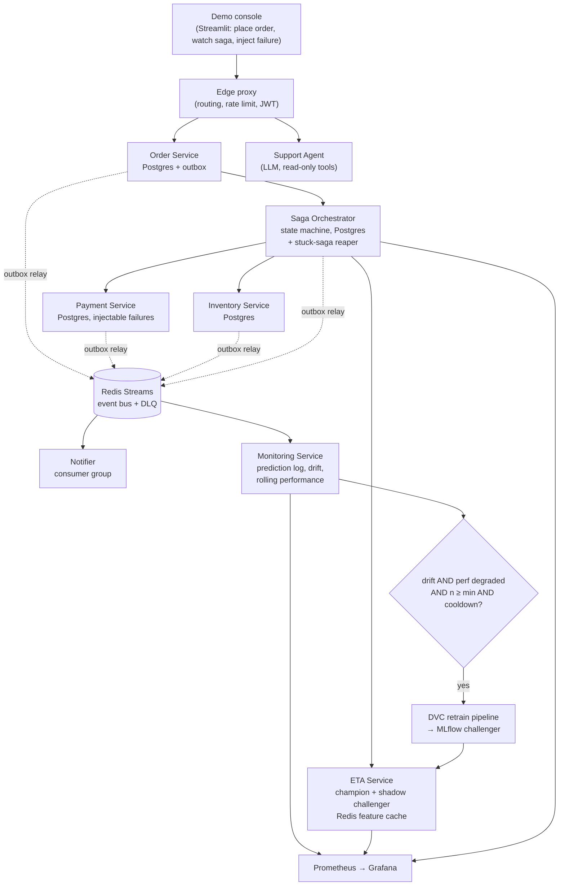
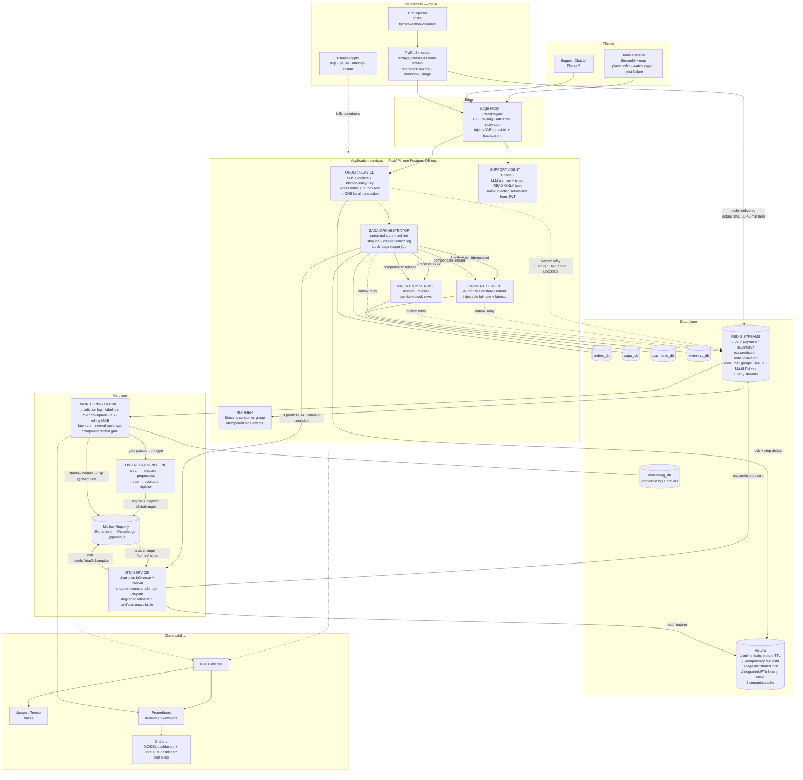
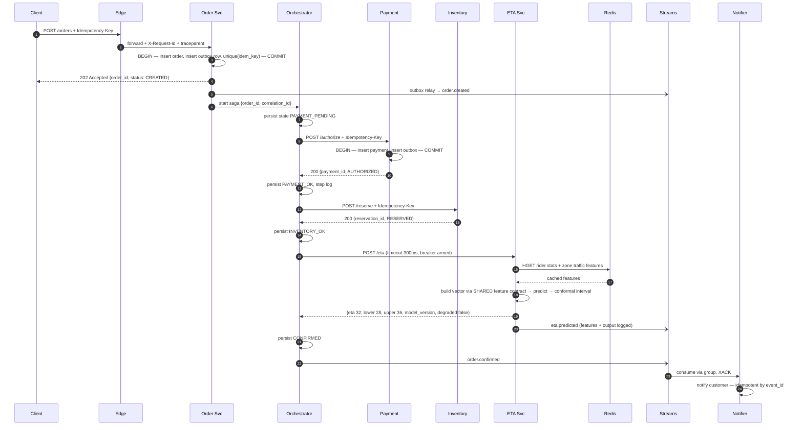
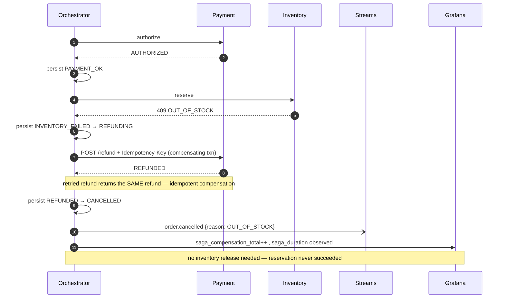
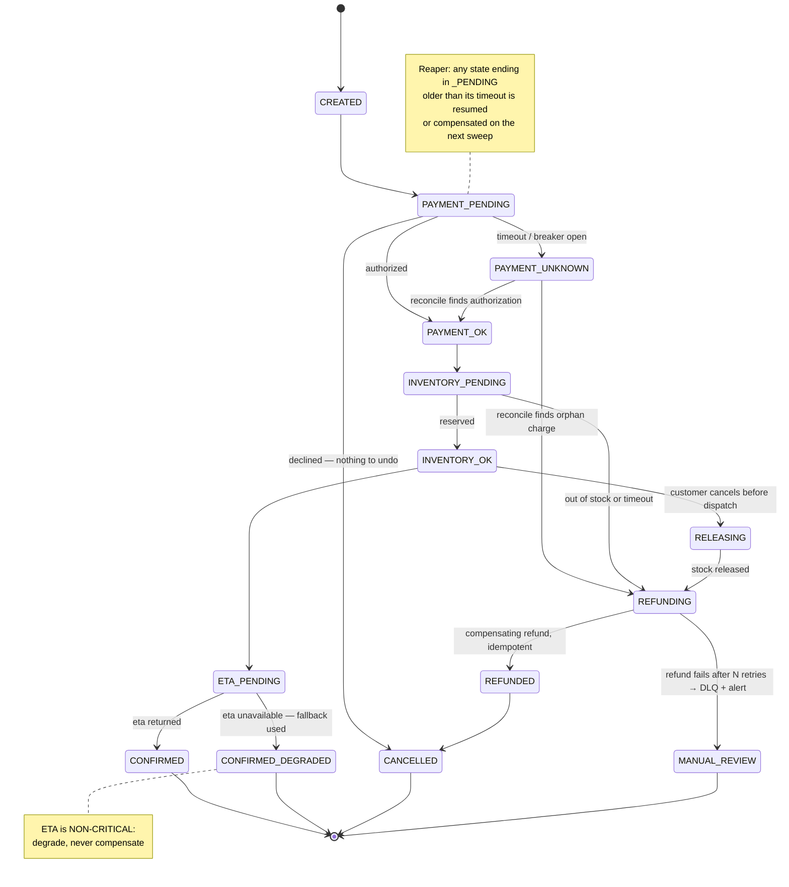
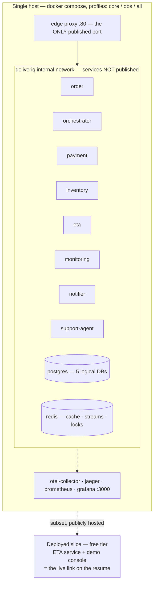

# DeliverIQ — Implementation Plan

**From**: `delivery-time-prediction` (a trained model with a demo UI)
**To**: an event-driven delivery-fulfilment backend where the ML model is a first-class service, with a closed monitoring loop around it.

This is a planning document only. No code is written yet. It contains:

1. Why this project exists (the answer to *"what's the use of building this?"*)
2. A full honest audit of the current repo — everything that must be cleaned or fixed first
3. Phased build plan (Phase 0 → Phase 10), each phase ending in something demoable
4. Appendices: architecture decision records to write, metric catalogue, interview defence matrix, claims you may/may not make

---

## 0. The North Star

### 0.1 One-paragraph description

DeliverIQ is the fulfilment backend of a food-delivery app. Placing an order runs a distributed transaction across Order, Payment and Inventory services; the ETA is produced by a served ML model that returns a *range*, not a single number, and degrades to a data-driven fallback if it is unavailable. Every prediction is logged; when the actual delivery time lands (late, as in real life), the system compares it to what was predicted, watches feature distributions for drift, and — only when drift *and* measured performance degradation coincide — triggers the DVC retraining pipeline, shadow-tests the challenger against the champion on live traffic, and promotes it automatically if it wins on accuracy, tail-lateness and latency.

### 0.2 Why this is a real problem (not a portfolio exercise)

This is the part that answers *"why would anyone build this?"*, and it should be in the README, because it is verifiably what the industry actually does:

| Business fact | Engineering consequence | Where it shows up in DeliverIQ |
|---|---|---|
| A wrong ETA costs money — too low ⇒ complaints and support tickets, too high ⇒ cart abandonment | Lateness must be penalised harder than earliness; a point estimate is not enough | Asymmetric loss + prediction intervals (Phase 2) |
| Traffic, weather and rider supply shift constantly | A model trained once silently rots; you need to *measure* it, not trust it | Drift + performance monitoring, gated retraining (Phase 6) |
| Money moves before goods are confirmed | You cannot hold a DB transaction across services; you need business-level undo | Saga + compensating transactions (Phase 3) |
| The ETA model is a dependency, not the app | A model outage must not stop orders | Graceful degradation + circuit breaker (Phase 2/4) |
| Ground truth arrives 30–45 min after the prediction | Monitoring must work with *delayed labels* | Two-tier monitoring: unlabelled drift now, performance later (Phase 6) |

Industry references to cite when defending the design (read these; they are your ammunition):

- DoorDash moved from quantile loss to a **custom asymmetric MSE** for ETA precisely because "a late delivery is X times worse than an early one", and validated with a two-week **shadow deployment** before an experiment — [Improving ETA Prediction Accuracy for Long-tail Events](https://careersatdoordash.com/blog/improving-eta-prediction-accuracy-for-long-tail-events/)
- DoorDash's newer ETA work outputs **probabilistic forecasts** and checks calibration with PIT histograms — [Improving ETAs with multi-task models and probabilistic forecasts](https://careersatdoordash.com/blog/improving-etas-with-multi-task-models-deep-learning-and-probabilistic-forecasts/)
- Swiggy decomposes ETA into **four legs** (order→assignment, first mile, wait time, last mile) with real-time restaurant/system stress features — [How ML powers "when is my order coming?"](https://bytes.swiggy.com/how-ml-powers-when-is-my-order-coming-part-ii-eae83575e3a9)

Your project is a scoped, honest version of that shape. That framing is what separates it from "I built a CRUD microservices demo".

### 0.3 Non-goals (deliberate, and you must be able to defend each)

| Excluded | Reason to give |
|---|---|
| Kubernetes / multi-region | 6 services on one host. Compose matches the real operational need; I can explain how this maps to K8s but I won't pretend I operated a cluster. |
| Kafka | Redis is already in the system for cache and state. Redis Streams gives consumer groups, acknowledgement and replay-by-ID without a second piece of infrastructure. Events are coordination here, not the system of record. ([comparison](https://dev.to/young_gao/real-time-event-streaming-kafka-vs-redis-streams-vs-nats-in-2026-34o1)) |
| Real payment gateway | The interesting part is transaction semantics and failure handling, not a PSP SDK. Payment is a stub with an injectable failure/latency mode. |
| Deep learning ETA model | The existing stacking ensemble is a fine baseline; the differentiator is the serving + monitoring loop, not a bigger model. |
| A second ML model for "infra anomaly detection" | No real training data, no validation set, no way to evaluate it. It would be a demo prop. |
| Hand-rolled API gateway | An edge proxy (Traefik/Nginx) does routing and rate limiting. Writing my own is re-implementing a reverse proxy. |
| A polyglot service (e.g. Go notifier) | Go would genuinely suit the stream consumer, but one toolchain bought depth instead of breadth. I can explain the trade-off; language choice is not the interesting decision here. |
| An at-dispatch ETA model | The feature contract is designed so a second leg could slot in, and I can describe Swiggy's leg-wise decomposition — but I chose to make one prediction moment correct rather than two approximate. |

Write these into `docs/adr/` as *rejected* options. Interviewers weight "why not X" answers heavily.

### 0.4 Honesty rule (non-negotiable)

There is no live traffic. Traffic comes from a **simulator** that replays the Kaggle Swiggy dataset as an order stream and can inject drift on demand. Say that out loud, in the README, before anyone asks. The simulator is a *test harness*, and having a deliberate, controllable one is a strength — it is what makes the drift and compensation stories demonstrable in 60 seconds instead of hypothetical.

---

## 1. Audit: what is wrong today, and what must be cleaned or fixed

Everything below was verified against the current working tree. Phase 0 fixes all of it. Nothing new gets built on top of these.

### 1.1 Bugs that break in production right now

| # | Issue | Where | Fix |
|---|---|---|---|
| 1 | **Serving-time row dropping** → 500 on valid input. `perform_data_cleaning` drops minors (`age < 18`), `ratings == 6`, and ends in `.dropna()`. On a single-row request, one unparseable or edge-case field yields an **empty DataFrame**, then `model_pipe.predict(...)[0]` raises `IndexError`. | `app.py:131-133`, `scripts/data_clean_utils.py:38-48,202` | Split cleaning into **training-time filtering** and **serving-time normalisation**. Serving never drops rows — it validates at the edge and returns a typed 422. |
| 2 | **Broken API container.** `Dockerfile` copies `models/preprocessor.joblib` but never `models/model.joblib`, which `app.py` loads at import. The image cannot start. | `Dockerfile:22-25` vs `app.py:86-87` | Copy or fetch both artifacts; add a container `HEALTHCHECK`; smoke-test the image in CI. |
| 3 | **Server binds `127.0.0.1`** inside the container → unreachable from outside even once it starts. | `app.py:139` | Bind `0.0.0.0`, port from config. |
| 4 | **`dagshub.init()` + `set_tracking_uri()` at import time** in the serving path — a network call on cold start; the app fails or hangs without credentials. Also hardcodes `repo_owner='maverick011'`. | `app.py:16-23` | Remove tracking-server calls from the serving path entirely. Artifacts are resolved at startup in a `lifespan` handler, from config. |
| 5 | **MLflow 3 API removals.** `client.transition_model_version_stage()` and `get_latest_versions(stages=[...])` were deprecated in MLflow 2.9 and **removed in MLflow 3.x**. `uv.lock` pins **mlflow 3.10.1**, so the last DVC stage and the promote script are broken today. | `src/models/register_model.py:70-80`, `scripts/promote_model_to_prod.py:29-40`, `tests/test_model_perf.py`, `tests/test_model_registry.py` | Migrate to **aliases**: `client.set_registered_model_alias(name, "champion", version)` and load via `models:/<name>@champion`. Use version **tags** for status. ([migration guidance](https://mlflow.org/docs/latest/ml/model-registry/workflow/)) |
| 6 | **No error handling, no health endpoints, no response contract.** `/predict` has no try/except, returns a bare NumPy float, no model version, no request id, no `/health`, no `/ready`. | `app.py:100-135` | Typed response model, exception handlers → RFC-7807-style errors, `/health` (liveness) and `/ready` (artifacts loaded), `/version`. |
| 7 | **Weak input schema.** Age, ratings and `multiple_deliveries` are `str`; lat/long unbounded; free-text where the encoder expects fixed categories. | `app.py:26-45` | Pydantic v2 with `Field` bounds, `Literal`/`Enum` categories generated from the same source as the encoder categories, explicit `schema_version`. |
| 8 | Dead code: `MlflowClient()` constructed and never used; `load_model_information` defined and never called. | `app.py:49-53,79` | Delete. |

### 1.2 ML-engineering problems (these are the highest-value fixes)

| # | Issue | Why it matters |
|---|---|---|
| 9 | **Feature availability leakage — the headline finding.** `pickup_time_minutes` = `order_picked_time − order_time`. At checkout, the order has not been picked up yet, so **this feature does not exist at prediction time**. `multiple_deliveries` (rider's concurrent orders) is only known after rider assignment. The current model is trained on information the caller cannot have. | This is the single most important thing to fix, and the best interview story in the project. Fix by **naming the prediction moment**: an *at-cart* model using only order-time-available features, and (optionally) an *at-dispatch* model that may use pickup/rider features. This is exactly Swiggy's leg-wise decomposition, scoped down. Expect the MAE to get worse — that is the *honest* number. |
| 10 | **No shared feature contract.** Column lists and category orders are duplicated in `app.py:63-76` and `src/features/data_preprocessing.py:17-38`. They will drift apart. | One versioned `contracts/features.py` imported by both training and serving; a parity test asserting the same raw input produces byte-identical feature vectors through both paths. |
| 11 | **Random train/test split on temporally ordered data.** `Data_Preparation.random_state: 42` with a random 25% split, while `order_date` exists. | Optimistic, leaky evaluation. Add a **time-based split** and report both numbers. |
| 12 | **Point prediction only, symmetric loss.** MAE treats 10 min early the same as 10 min late. | Add asymmetric objective + intervals (Phase 2). This is what DoorDash explicitly changed. |
| 13 | **No promotion gate.** `evaluation.py` logs metrics; `register_model.py` registers regardless of whether the model got worse. | Nothing stops a regression reaching serving. Gate registration on threshold + comparison to champion. |
| 14 | **`cross_val_score` (cv=5, n_jobs=-1) inside the evaluation stage** re-fits the whole stacking ensemble five times on every pipeline run. | Slow pipeline, makes CI-on-PR impractical. Move CV to the experimentation notebooks; the pipeline evaluates the trained artefact and (optionally) a fast holdout. |
| 15 | **sklearn/joblib version coupling.** Artifacts are `joblib` pickles; a different sklearn at serving time can fail loudly or, worse, quietly. | Record the training environment in a model card; assert the runtime version at load and refuse to serve on mismatch. |
| 16 | **No prediction logging, no drift detection, no monitoring, no retraining trigger.** | The entire reason for Phases 5–6. |
| 17 | `.dropna()` in `data_cleaning.py` discards rows wholesale, though the notebooks explicitly compared drop-vs-impute. | Either document the decision with the numbers from that experiment, or revisit it. Free interview answer if documented, a hole if not. |

### 1.3 Reproducibility

| # | Issue | Fix |
|---|---|---|
| 18 | **A fresh clone cannot reproduce anything.** `data/` is gitignored, there are **no `.dvc` files**, and `git ls-files data` is empty — yet `data/raw/swiggy.csv` is a hashed dependency in `dvc.lock`. A DO Spaces remote is configured, but the raw input is not tracked or pushed. `dvc repro` fails immediately for anyone else. | `dvc add data/raw/swiggy.csv`, commit the `.dvc` file, `dvc push`, document `dvc pull` in the README. Verify by cloning into a clean directory. |
| 19 | `register_model` DVC stage declares no `outs`. | Emit `reports/registry.json` so the stage is a real, cache-aware node. |
| 20 | Two dependency sources: `pyproject.toml`/`uv.lock` and a hand-maintained `requirements.txt` (which omits fastapi and mlflow). Plus a duplicated copy of `scripts/data_clean_utils.py` inside `hf_deploy/`. | `pyproject.toml` per service is the single source; generate deploy requirements, never hand-edit; delete duplicated code. |

### 1.4 Configuration & security

| # | Issue | Fix |
|---|---|---|
| 21 | Hardcoded DagsHub owner/repo/URI in **five** files (`app.py`, `src/models/evaluation.py`, `src/models/register_model.py`, `scripts/promote_model_to_prod.py`, and the two registry tests). `.env` is the untouched cookiecutter template. | `pydantic-settings` config object per service, `.env.example` committed, real `.env` ignored, CI via GitHub Secrets. Zero literals of owner/URI/threshold in code. |
| 22 | Docker image runs as root, unpinned base tag, no healthcheck. | Non-root user, pinned digest, `HEALTHCHECK`, `uv sync --frozen --no-dev`. |
| 23 | No rate limiting, no body-size limit, no CORS policy, no auth of any kind. | Rate limit + body cap at the edge proxy; JWT for customer-facing routes; internal routes reachable only on the compose network. |

### 1.5 Tests & CI

| # | Issue | Fix |
|---|---|---|
| 24 | **`tests/test_model_perf.py:12-17` and `tests/test_model_registry.py:8-13` point at `himanshu1703/swiggy-delivery-time-prediction`** — a different person's DagsHub repo. These tests cannot ever have passed in your setup. Anyone reading the repo sees it. | Rewrite against your own registry with config, not literals. And decide your provenance story now: *"I built this following a course project, then rebuilt the serving, monitoring and distributed-systems layers myself"* is a perfectly strong answer. Leftover pointers to someone else's account with no explanation is not. |
| 25 | `tests/test_api_endpoint.py` needs a live server on `127.0.0.1:8000` and reads gitignored raw data → unrunnable anywhere but your machine. | `fastapi.testclient.TestClient` + a small committed fixture file. |
| 26 | **No `.github/` directory at all** — there is no CI, despite the project presenting as production-ready. | Phase 8. |

### 1.6 Repo hygiene and credibility signals

| # | Issue | Fix |
|---|---|---|
| 27 | `hf_deploy/` contains a **nested `.git` with LFS objects** inside the working tree; `out.txt`, empty `local_model_dir/`, stray `__pycache__/`, `run_claude.ps1`/`run_claude.sh` at root. | Deploy target becomes a build artefact produced into `dist/` (gitignored) or a separate remote — never a nested repo in the tree. Delete the rest. |
| 28 | ~100k lines of notebooks committed in one go (10 files). Legitimate experiment history, but unreadable as a repo. | Keep 2 curated notebooks (EDA, model selection) with outputs stripped; move the rest to `notebooks/archive/` or a branch; add `nbstripout`. |
| 29 | `docs/` is untouched Sphinx cookiecutter scaffolding, `main.py` is a 102-byte stub, `Makefile` is boilerplate. | Delete or make real. Dead scaffolding reads as "generated from a template and never understood". |
| 30 | Git history: 4 commits, one titled "Update project" with 100k insertions. | From here on: conventional commits, one concern per commit, PRs with a description. Interviewers do read history. |
| 31 | README lists a tech stack but no architecture, no metrics, no limitations. | Phase 10. |
| 32 | Windows/WSL specifics: mixed line endings likely, and bind-mounted Docker volumes are slow from the Windows filesystem. | `.gitattributes` with `* text=auto eol=lf`; run compose from the WSL2 filesystem. |

### 1.7 What is genuinely good and must be preserved

Keep and build on: the 6-stage DVC pipeline; the stacking ensemble with tuned hyperparameters in `params.yaml`; the domain feature engineering (haversine distance, distance bands, time-of-day, weekend); the target power transform; MLflow tracking; the map-based Streamlit UI (it becomes a client of the API, not a copy of the model); the Docker/HF deployment experience.

---

## 2. Target architecture



### 2.1 Repository layout

Evolve this repo in place — the git history showing an ML project growing into a system is an asset. Rename the repo to `deliveriq`.

```
deliveriq/
├─ services/
│  ├─ order/            # FastAPI + Postgres + outbox
│  ├─ payment/          # stub PSP with injectable failure/latency
│  ├─ inventory/        # stock reservation + release
│  ├─ orchestrator/     # saga state machine + reaper
│  ├─ eta/              # ML serving (champion + shadow)
│  ├─ notifier/         # stream consumer
│  ├─ monitoring/       # prediction log, drift, retrain trigger
│  └─ support_agent/    # LLM slice — read-only tools (Phase 9)
├─ platform/            # shared INFRASTRUCTURE only — never business logic or models
│  ├─ config.py  logging.py  otel.py  http.py (retry+breaker)
│  ├─ idempotency.py  outbox.py  streams.py  errors.py
├─ contracts/           # versioned event schemas + the feature contract
├─ ml/                  # the existing DVC pipeline, moved here
│  ├─ pipeline/  features/  evaluation/  monitoring/  params.yaml  dvc.yaml
├─ ops/                 # compose files, prometheus, grafana dashboards, alerts, migrations
├─ tools/               # traffic simulator, drift injector, chaos scripts, load test
├─ ui/                  # demo console (refactored Streamlit)
├─ tests/               # unit / contract / integration / e2e
└─ docs/                # adr/, architecture.md, runbook.md, model_card.md, interview_notes.md
```

**Rule for `platform/`:** infrastructure primitives only. The moment a shared DB model or business rule lands there, you have a distributed monolith and the DB-per-service claim becomes false. Be ready to say that.

### 2.2 Data store decisions (each becomes an ADR)

| Concern | Choice | Defence |
|---|---|---|
| Service data | PostgreSQL, **one logical database per service**, no cross-service joins, no shared models | Enforces the boundary. One instance locally for cost; document that production = separate clusters. Honest, not simulated. |
| Saga state | **PostgreSQL** (orchestrator's own DB) | In-flight sagas move money. Redis persistence has a durability window; a crash can lose state. Saga state also needs to be queryable and auditable. If asked "why not Redis" — this is the answer. |
| Idempotency keys | Redis (fast path) **+ a unique constraint in Postgres** (source of truth) | Redis alone can lose a key and double-charge. The DB constraint is the guarantee; Redis is the optimisation. |
| Online features | Redis hashes with TTL | Sub-ms lookups on the inference path. |
| Event bus | Redis Streams, consumer groups, `MAXLEN ~` caps, explicit `XACK`, DLQ stream | Already deployed; gives at-least-once + replay + consumer groups without a second system. Uncapped streams OOM Redis — cap them. |
| Prediction log | Postgres (monitoring service DB) | Needs joins against late-arriving actuals and window aggregation. |

---

## 3. Phased plan

Each phase ends with something you can run and show. Never leave a layer half-built across phases.

---

### Phase 0 — Clean and harden what exists

Nothing new. Close every item in §1. Do this first; a saga on top of an API that crashes on a malformed body is building on sand.

**Work**

1. Repo hygiene: §1.6 (remove `hf_deploy/` nested git, `out.txt`, `local_model_dir/`, stray scripts; strip/archive notebooks; delete or complete `docs/`, `main.py`, `Makefile`; add `.gitattributes`).
2. Config: `pydantic-settings` + `.env.example`; remove all hardcoded DagsHub/MLflow literals from the five files; secrets via env only.
3. **Feature contract**: create `contracts/features.py` as the single definition of raw input schema, engineered columns, category orders and `FEATURE_SCHEMA_VERSION`. Import it from both the DVC pipeline and the API.
4. **Split cleaning** into `filter_training_rows()` (drops) and `normalise_for_inference()` (never drops), sharing all transformation logic. Serving path: validate → normalise → predict, with a typed 422 on invalid input.
5. **Fix the leakage**: define the prediction moment as *at-cart*; drop `pickup_time_minutes` and `multiple_deliveries` from the at-cart feature set; retrain; record the new (worse, honest) MAE next to the old one and explain why in the model card.
6. Add a **time-based split** alongside the random split; report both.
7. Rewrite `app.py` properly: lifespan artifact loading, typed request/response, exception handlers, `/health`, `/ready`, `/version`, bind `0.0.0.0`, sklearn version assertion at load.
8. Fix the Dockerfile: both artifacts, non-root, pinned base, healthcheck.
9. **MLflow 3 migration**: aliases (`@champion`, `@challenger`, `@previous`) everywhere; delete stage transitions; `register_model` gets a real `out`.
10. DVC: `dvc add data/raw/swiggy.csv`, commit, `dvc push`; verify `dvc pull && dvc repro` in a clean clone.
11. Tests: rewrite the three broken tests; add golden-value tests for feature transforms; add the **training/serving parity test**; move CV out of the pipeline.
12. Swap flake8 → **ruff** (+ format), add light mypy on `contracts/` and `platform/`.
13. README: state provenance and current limitations honestly.

**Done when**: a clean clone can `dvc pull && dvc repro`, `pytest` is green offline, `docker compose up eta` serves a valid prediction and a typed 422 for garbage, and no credential, owner name or threshold is hardcoded anywhere.

---

### Phase 1 — Platform foundations

**Work**

- Compose stack: Postgres (3 logical DBs) + Redis + edge proxy; profiles for `core`, `obs`, `all`.
- `platform/`: settings, **structured JSON logging** with `correlation_id`/`trace_id`, error envelope, HTTP client with timeout + retry-with-jitter + circuit breaker, Redis and Streams helpers.
- Service skeleton template: FastAPI app factory, `/health` + `/ready` (readiness = dependencies actually reachable), Alembic migrations, request-id middleware, graceful shutdown.
- `contracts/events.py`: event envelope (`event_id`, `event_type`, `event_version`, `occurred_at`, `correlation_id`, `idempotency_key`, `payload`) + versioning rules (additive-only, never repurpose a field).

**Done when**: `docker compose up` brings up all skeletons healthy, one request produces a log line in every service carrying the same correlation id, and migrations run from scratch.

---

### Phase 2 — ETA Service (the ML core, done properly)

This is the phase that makes the project *yours*. Give it the most depth.

**Work**

1. **Model loading**: resolve `models:/delivery_eta@champion` from MLflow at startup, with a bundled local artifact as an offline fallback; `/admin/reload` to pick up an alias flip without a redeploy; expose model version + feature schema version in every response.
2. **Prediction intervals.** Two options, pick one and defend it:
   - *Recommended*: **split/inductive conformal** on top of the existing ensemble — a held-out calibration set of absolute residuals, quantile recomputed on a schedule, interval generation is a constant-time lookup at inference. Distribution-free coverage, near-zero latency. ([overview](https://valeman.medium.com/conformalized-quantile-regression-smarter-uncertainty-prediction-for-data-scientists-6389bea7a7c4))
   - *Alternative*: LightGBM **quantile regression** at q=0.1/0.5/0.9, optionally conformalised (CQR) for calibrated coverage.
   Then serve `"28–36 min"` like a real app, and track **interval coverage** as a first-class metric — if you claim 90% intervals, the dashboard must show ~90%.
3. **Asymmetric cost**: add a custom objective or sample weighting where under-prediction (late) is penalised k× over-prediction, with `k` in `params.yaml`. Report MAE, plus **late-rate** (`actual > predicted + 5 min`) as the business metric. Show the trade-off curve as `k` varies — that is a genuinely senior-level artefact.
4. **Feature store (online)**: Redis hashes for rider rolling stats and zone/hour traffic aggregates, written by a small builder job, TTL'd, versioned keys. The offline pipeline computes the same features **through the same code path** — that shared path is the whole point. Document the point-in-time-correctness caveat honestly. (ADR: considered Feast, rejected — operational overhead exceeds the benefit at this scale.)
5. **Latency budget**: measure p50/p95/p99 in-process; set an SLO (e.g. p99 < 150 ms); histogram to Prometheus; optional micro-batching under load, only if the numbers justify it.
6. **Graceful degradation**: a data-driven fallback — historical median ETA by (distance band × city × time-of-day) precomputed into Redis, not a hardcoded "30–45 min". Responses carry `degraded: true`, and `eta_degraded_total` is a metric with an alert.
7. **Shadow slot**: the service can serve champion while also scoring `@challenger` on the same request off the response path, logging both. This is the hook Phase 6 promotion needs, so build it now.

**Done when**: `POST /eta` returns `{eta_minutes, lower, upper, model_version, feature_schema_version, degraded, latency_ms, request_id}`; killing MLflow/Redis still yields a degraded answer; p99 is measured and published; the parity test proves training and serving compute identical features.

---

### Phase 3 — Order, Payment, Inventory + Saga

**Work**

- **Order Service**: `POST /orders` with a mandatory `Idempotency-Key` header. Idempotency = unique constraint on the key + stored response; a replay returns the original response with the original status, never a second order.
- **Payment / Inventory**: reserve + release semantics, own DBs, deterministic failure injection via config (`fail_rate`, `latency_ms`, `timeout`, `always_fail_for_amount_over`) so demos are reproducible rather than lucky.
- **Saga orchestrator**: explicit state machine, persisted per step:
  `CREATED → PAYMENT_PENDING → PAYMENT_OK → INVENTORY_PENDING → INVENTORY_OK → ETA_PENDING → CONFIRMED`
  with compensation paths `INVENTORY_FAILED → REFUNDING → REFUNDED → CANCELLED`.
  - ETA failure does **not** compensate — it degrades. That asymmetry (critical vs non-critical step) is a strong design point.
  - **Stuck-saga reaper**: a periodic job that finds sagas in a pending state past a timeout and resumes or compensates them. This is the thing juniors forget; having it is a differentiator.
- **Outbox pattern**: state change + outbox row in one local transaction; a relay polls with `SELECT ... FOR UPDATE SKIP LOCKED` and publishes to Redis Streams; at-least-once, so consumers are idempotent by design. ([why](https://developer.confluent.io/courses/microservices/the-transactional-outbox-pattern/))
- Compensation must be **idempotent** — a refund attempted twice refunds once.

**Done when**: happy path completes end-to-end; forcing a payment failure, an inventory failure, an ETA timeout, and killing the orchestrator mid-saga each end in a correct, explainable terminal state, all four covered by integration tests.

---

### Phase 4 — Event bus, consumers, resilience

**Work**

- Redis Streams per event type (or one stream with typed events — decide and document), consumer groups per consumer, explicit `XACK`, `MAXLEN ~` caps.
- **Retry then DLQ**: N attempts with backoff, then move to a `dlq:*` stream with the failure reason and original envelope; a `/dlq` admin endpoint to inspect and replay. Poison messages must never block the group.
- **Pending-entry reclaim**: `XAUTOCLAIM` for messages orphaned by a dead consumer.
- Notifier service consuming `order.confirmed` / `order.cancelled` (logs the "notification" — do not build an email integration).
- Circuit breaker on every inter-service HTTP call; breaker state as a Prometheus gauge.
- Event schema evolution: consumers tolerate unknown fields; a contract test locks the current shape so a breaking change fails CI.

**Done when**: a deliberately poisoned event lands in the DLQ without stalling the stream, is replayable after a fix, killing a consumer mid-processing loses nothing after reclaim, and duplicate delivery produces exactly one side effect.

---

### Phase 5 — Observability

**Work**

- **OpenTelemetry** auto-instrumentation on every FastAPI service, W3C trace-context propagation across HTTP *and* through the stream hop (carry `traceparent` in the event envelope — this is the part most people miss), exported to Jaeger or Tempo.
- Trace id injected into every structured log line; `contextvars`-based so it survives `asyncio` tasks and background workers.
- **Prometheus** metrics with **exemplars** so a latency-histogram spike in Grafana links straight to the trace. ([practice](https://dev.to/kaushikcoderpy/fastapi-distributed-tracing-the-complete-opentelemetry-guide-2026-k))
- Grafana dashboards, split deliberately:
  - **Business/model**: rolling MAE, late-rate, interval coverage, degraded-prediction rate, drift PSI per feature, champion vs challenger comparison.
  - **System**: saga success/compensation counts, saga duration, outbox lag, DLQ depth, breaker state, request latency percentiles.
- Alert rules with **reasons**, not vibes: `late_rate > x for 15m`, `outbox_lag > n`, `dlq_depth > 0`, `interval_coverage` outside ±5% of target, `eta_degraded_rate > y`.

**Done when**: one order produces a single trace spanning order → orchestrator → payment → inventory → ETA → stream → notifier, and you can click from a Grafana latency spike into that trace.

---

### Phase 6 — Closed-loop ML monitoring (the differentiator)

**Work**

1. **Prediction log**: every prediction persisted with input features, output, interval, model version, feature schema version, correlation id, timestamp.
2. **Delayed labels**: actuals arrive via an `order.delivered` event 30–45 simulated minutes later and are joined onto the prediction row. Handle *unmatched* rows explicitly (never delivered, cancelled). **State the label lag out loud** — it is the honest hard part of the problem, and knowing it is the sign you understand production ML.
3. **Two-tier monitoring**:
   - *Immediately available*: feature and prediction distribution drift — **PSI** per feature with practical thresholds (<0.1 none, 0.1–0.2 moderate, >0.2 significant), chi-square for categoricals, KS with a controlled sample size (KS on large samples flags statistically-significant-but-meaningless differences, so report the effect size beside the p-value). ([why](https://www.evidentlyai.com/blog/data-drift-detection-large-datasets))
   - *Once labels land*: rolling MAE, late-rate, interval coverage on a sliding window.
   - Use **Evidently** for the reports/metrics rather than hand-rolling every test, and export to Prometheus. Optionally **NannyML CBPE** to *estimate* performance before labels arrive — a strong optional depth item given the label lag.
4. **Retraining gate — a compound condition, not "drift → retrain"**:
   `drift_significant AND performance_degraded AND n_samples ≥ min AND time_since_last_retrain > cooldown` → trigger.
   Drift without measured impact is a false alarm, and retraining on false alarms is how you build a system that thrashes. Log every gate evaluation, including the ones that decided *not* to retrain — a graph of suppressed triggers is a great artefact. ([evidence](https://arxiv.org/html/2607.17336))
5. **Retrain**: the trigger runs the existing DVC pipeline on the accumulated log + original data, logging to MLflow as `@challenger`.
6. **Champion/challenger promotion**: shadow the challenger on live traffic (Phase 2 hook), compare on the *same* requests, and promote only if **all** gates pass — MAE improvement > threshold, late-rate not worse, interval coverage within tolerance, p99 latency within budget, minimum shadow sample size. Promotion = flip the `@champion` alias; keep `@previous` for one-command rollback. Auto-rollback if post-promotion late-rate breaches the alert threshold.
7. **Drift injector** (`tools/`): shift traffic toward `jam`, weather toward `stormy`, or distance distribution upward, so you can demonstrate the whole loop — detect → gate → retrain → shadow → promote — on demand.

**Done when**: running the drift injector produces, without manual intervention: rising PSI on the dashboard → degraded rolling MAE once labels land → gate fires → challenger trained and registered → shadow comparison → automatic promotion and an alias flip the ETA service picks up. Record this as a video; it is the centrepiece of the project.

---

### Phase 7 — Traffic simulator, chaos, demo console

**Work**

- **Simulator**: replays the dataset as a Poisson-ish order stream at a configurable rate, with scenario files (`normal`, `monsoon`, `festival_surge`, `rider_shortage`), and emits `order.delivered` with a realistic actual-vs-predicted relationship (including a controllable bias so drift is not fake).
- **Chaos scripts**: plain shell — `docker compose stop payment`, `pause` for timeouts, `tc`/proxy latency injection, Redis restart mid-saga. A bash script that kills a container is honest chaos engineering; a framework would be overhead.
- **Demo console** (refactor the existing Streamlit app into a thin API client — this also fixes the 649-line monolith): place an order on the map, watch saga state transition live, see the ETA with its interval, toggle failure injection, view drift and champion/challenger panels.
- **Load test** (Locust or k6): publish real numbers — throughput, p50/p95/p99 per service, breaker behaviour under saturation. Numbers you measured beat adjectives.

**Done when**: `make demo` brings up the stack, runs a scenario, and the console shows orders flowing, a failure compensating, and a drift alert firing — in under two minutes, unattended.

---

### Phase 8 — Testing strategy & CI/CD

**Test pyramid**

| Layer | Scope |
|---|---|
| Unit | Feature transforms (golden values), saga state-machine transition table, idempotency store, breaker, PSI/KS math against known inputs |
| Contract | Event envelope + per-event schema snapshots; the **training/serving feature parity** test; API schema snapshot |
| Integration | **testcontainers** Postgres + Redis: happy path, each compensation path, crash-and-resume, duplicate event delivery, DLQ and replay, outbox relay under contention |
| ML | Feature contract conformance, performance threshold vs the champion, interval coverage on the calibration set, drift detector sensitivity on synthetic shifts |
| E2E | Compose up + simulator + assertions on final states and emitted metrics |
| Load | Locust/k6 with a published report |

**CI (GitHub Actions)**

- PR: ruff + format check, mypy (scoped), unit + contract, integration with service containers, docker build for changed services. Target under ~10 minutes; cache `uv` and layers.
- PR touching `ml/`: fast DVC pipeline on a sampled dataset + the model performance gate.
- Main: E2E on compose, image publish, dashboard/alert-rule lint.
- Nightly: full DVC repro, `pip-audit`, drift-detector regression suite.
- Branch protection on `main`. Conventional commits. PR template with a "how I tested this" section.

**Done when**: a red build blocks merge for a real reason, and CI runs green from a clean clone with no local state.

---

### Phase 9 — The modern-AI slice: order support agent *(in scope — built last, scoped tightly)*

This is what makes the project read as 2026 rather than 2019 — provided it is engineered, not prompted. The rule: **the LLM is a natural-language interface over deterministic, read-only tools. It cannot mutate state, and it cannot choose whose data it sees.**

**Work**

1. **Typed tool contracts** (Pydantic in/out): `get_order_status`, `get_eta_with_interval`, `explain_eta`, `get_refund_status`, `escalate_to_human`. All read-only. Tool contracts and validation come *first*, before any prompt work.
2. **Authorisation is server-side.** `customer_id` comes from the validated JWT and is injected by the tool layer — never from the model's arguments. This is the defence against a prompt-injected "show me order 12345 from another customer", and it is the single best security answer in the project.
3. **`explain_eta` is the piece that ties AI to ML**: SHAP top-k feature attributions from the ETA model, rendered as plain language — *"jam-level traffic on your route and stormy weather are adding about 8 minutes"*. Genuinely useful, and impossible to dismiss as a chatbot bolt-on.
4. **Guardrails on four surfaces** with an explicit latency budget: input (injection heuristics), tool-call (allowlist, arg validation, max steps, per-conversation timeout), output (no PII echo, no refund/compensation promises), plus a hard token/cost ceiling per conversation. A guardrail that costs 400 ms becomes the product's latency story — measure it. ([reference](https://futureagi.com/blog/ultimate-guide-llm-guardrails-2026/))
5. **Semantic cache in Redis**, added *last* and gated on precision, not hit rate. Track precision/recall/F1, cache vs LLM latency, and tokens saved. Hit rate alone is a vanity metric. ([reference](https://valuestreamai.com/blog/ai-caching-strategies-2026))
6. **Evaluation**: a committed set of ~40 scenarios with deterministic assertions (did it call the right tool? did it refuse the injection? did it leak another customer's data?), plus LLM-as-judge for tone only. Run in CI against a cheap model; report pass rate. Span-level and trace-level metrics, as with any other service.
7. **Observability**: OTel spans per LLM call and per tool call, cost and token metrics on the Grafana dashboard alongside everything else. Model choice: a small/fast model for routing, a stronger one for synthesis — and say why.

**Defence when challenged**: *"It is a distributed system where an LLM is the planner. State changes stay in the saga. Authorisation is enforced in the tool layer, not the prompt. Every answer is traceable, budgeted and evaluated against a fixed scenario suite."*

Skip this phase entirely rather than half-build it. A well-built system with no LLM beats a system with a chatbot you cannot defend.

---

### Phase 10 — Documentation, deployment, interview readiness

**Work**

1. **README** (the highest-leverage file in the repo): one-paragraph what/why, architecture diagram, 60-second quickstart, the demo GIF/video, a **measured metrics table** (MAE, late-rate, interval coverage, p99 latency, throughput), and an explicit **Known limitations** section. Stating limitations is a maturity signal; hiding them is a risk.
2. **ADRs** (`docs/adr/`, one page each — see appendix A). This *is* your "defend every part" artefact.
3. **Diagrams**: C4 context + container, sequence diagrams for happy path and for the compensation path, and the retraining-loop state diagram.
4. **Model card**: intended use, prediction moment and available features, training data and window, offline metrics on both splits, interval coverage, known failure modes, training environment versions, retraining policy.
5. **Runbook**: what each alert means and what to do; how to roll back a model; how to drain the DLQ.
6. **Deployment**: full stack via `docker compose up` (honest for this scale) + one publicly deployed slice — the ETA service and demo console on a free tier — so there is a live link. Say plainly which parts are deployed and which are local.
7. **Interview notes** (`docs/interview_notes.md`, private or committed): for each component — what problem it solves, what alternatives you rejected and why, what breaks if you remove it, and one thing you would do differently at 100× scale.
8. **Résumé lines** (see appendix D for what you may and may not claim).

---

## Appendix A — ADRs to write

1. Redis Streams over Kafka for the event bus
2. Postgres over Redis for saga state
3. Orchestration over choreography for the saga
4. Database-per-service, one instance locally
5. Outbox with polling relay over CDC/Debezium
6. Idempotency: DB constraint as truth, Redis as fast path
7. Docker Compose over Kubernetes
8. Redis online store over Feast
9. Conformal intervals over Bayesian/ensemble uncertainty
10. Asymmetric loss over plain MAE for ETA
11. Compound retrain gate over drift-only triggering
12. Alias-based promotion over MLflow stages (and the 3.x migration)
13. Prediction moment = at-cart; dropping post-order features
14. LLM as read-only tool caller with server-side authorisation
15. Edge proxy over a custom API gateway
16. All-Python services over a polyglot notifier

## Appendix B — Metric catalogue

**Model**: rolling MAE (window) · late-rate (`actual > pred + 5min`) · interval coverage vs target · prediction distribution PSI · per-feature PSI/chi-square · degraded-prediction rate · challenger-vs-champion delta · inference p50/p95/p99 · feature-cache hit rate

**System**: saga success/compensation/stuck counts · saga duration percentiles · outbox lag and relay throughput · DLQ depth and age · breaker state per dependency · idempotent-replay count · stream consumer lag per group

**AI (Phase 9)**: tool-call success rate · guardrail block rate by surface · semantic-cache precision/recall/hit-rate · tokens and cost per conversation · eval-suite pass rate

Rule: every dashboard panel must map to a decision someone would make. If it does not, delete the panel — CPU graphs are vanity here.

## Appendix C — Interview questions this project must answer

Prepare a written answer for each, and know which file proves it:

- Why a saga and not 2PC? What exactly is "compensating" versus "rolling back"?
- What happens if the orchestrator dies between payment success and inventory reservation?
- Your relay published an event and crashed before deleting the outbox row. What happens?
- The same order request arrives twice, 5 ms apart, same idempotency key. Walk me through it.
- Why is the ETA failure not compensated, when the inventory failure is?
- Where does the ETA feature vector come from at prediction time, and how do you know it matches training?
- Your model was trained on `pickup_time_minutes`. Is that available at checkout? *(This is the trap. You fixed it in Phase 0 — say so.)*
- Traffic distribution shifted but MAE is flat. Do you retrain? Why not?
- Your new model has better MAE but worse late-rate. Do you promote it?
- Your 90% interval covers 71% of actuals. What is broken?
- How do you roll back a bad model, and how long does it take?
- Redis restarted and lost 200 ms of writes. What did you lose, and does it matter?
- Why Redis Streams and not Kafka? At what point would you switch?
- Why not Kubernetes?
- *(Phase 9)* How do you stop the agent from reading another customer's order?

## Appendix D — Claim discipline

**You may say**: "event-driven backend with saga-based distributed transactions"; "ML model served with prediction intervals and a data-driven degradation path"; "closed-loop monitoring with drift detection and gated automatic retraining, validated by shadow deployment"; "measured p99 inference latency of X ms at Y req/s"; "traffic and drift are driven by a simulator I built".

**You may not say**: "production system" (no real users); "handles N million requests" (unless you load-tested it and can show the report); "deployed on Kubernetes"; "real-time payment processing". One inflated claim that collapses under a follow-up question costs more than the whole project earns.

**On provenance**: the current tests point at another person's DagsHub repo, so decide the story now and say it first. *"I started from a course project for the model, then rebuilt serving, monitoring and the distributed layer myself"* is credible and common. Silence plus someone else's username in your test files is not.

## Appendix E — Build discipline

- Vertical slices, always. Every phase ends with a running system.
- One concern per commit, conventional messages, PR per phase-chunk. History is read.
- Fix `main` before adding to it. A red pipeline you have learned to ignore is worse than no pipeline.
- Cut scope, not depth. Three components you can defend for 20 minutes each beat ten you configured.
- Write the ADR when you make the decision, not the week before the interview. You will not remember why.

---

## Appendix F — The final system design (what you show the interviewer)

This is the end-state picture. Diagram F1 is the one you draw on the whiteboard; F2–F6 are the drill-downs for whichever part they pick. Every box below is something the phases above actually build — nothing here is aspirational.

### F1 — Full system design



**How to narrate F1 in 90 seconds** (this is the script — practise it):

> "A client posts an order through the edge proxy with an idempotency key. Order Service writes the order row and an outbox row in one local transaction, so there is no dual-write. The saga orchestrator drives payment, then inventory, then ETA, persisting each state transition to its own database so a crash is recoverable — a reaper resumes anything stuck. If inventory fails after payment succeeded, the orchestrator issues a compensating refund; if ETA fails, it does *not* compensate, it degrades, because an ETA is not worth cancelling an order over. Every service publishes events via its outbox relay into Redis Streams, consumed by the notifier and the monitoring service. Monitoring logs each prediction, joins the actual delivery time when it arrives 30-45 minutes later, computes drift and rolling accuracy, and only when drift *and* real degradation coincide does it trigger the DVC pipeline. The new model is registered as challenger, shadow-scored on live traffic, and promoted by flipping an MLflow alias if it wins on accuracy, tail lateness and latency. Everything is traced end to end, including across the stream hop."

### F2 — Happy path: order → confirmed



### F3 — Compensation path: payment succeeded, inventory failed



### F4 — Saga state machine (with failure and recovery edges)



### F5 — The closed ML loop (the part nobody else has)

```mermaid
flowchart LR
    REQ["order at checkout"] --> FEAT["Feature builder<br/>SHARED contract module<br/>same code path as training"]
    FEAT --> RC[("Redis online store")]
    RC --> INF["Champion inference<br/>+ conformal interval"]
    RC --> SHADOW["Challenger — shadow<br/>off response path"]
    INF --> RESP["Response to saga<br/>eta + range + version"]

    INF --> PLOG[("Prediction log<br/>features, output, versions, ts")]
    SHADOW --> PLOG
    ACT["order.delivered<br/>ACTUAL time — arrives 30-45 min later"] --> JOIN["Label join<br/>handle unmatched: cancelled / never delivered"]
    PLOG --> JOIN

    JOIN --> T1["Tier 1 — no labels needed<br/>PSI per feature · chi-square categorical<br/>KS with controlled sample + effect size<br/>prediction distribution shift"]
    JOIN --> T2["Tier 2 — labels landed<br/>rolling MAE · late-rate<br/>interval coverage vs target"]

    T1 --> GATE{"COMPOUND GATE<br/>drift significant<br/>AND performance degraded<br/>AND n ≥ min_samples<br/>AND cooldown elapsed"}
    T2 --> GATE
    GATE -->|"suppressed — logged with reason"| SUP2["No retrain<br/>drift without impact = false alarm"]
    GATE -->|"fire"| RETRAIN["DVC repro on log + base data<br/>→ MLflow run → @challenger"]

    RETRAIN --> SHADOW
    SHADOW --> CMP{"Promotion gates<br/>MAE improved > threshold<br/>late-rate not worse<br/>coverage within tolerance<br/>p99 within budget<br/>shadow n ≥ min"}
    CMP -->|"all pass"| PROMOTE["flip @champion<br/>keep @previous"]
    CMP -->|"any fail"| KEEP["keep champion<br/>archive challenger with reason"]
    PROMOTE --> RELOAD["ETA service reloads alias<br/>no redeploy"]
    RELOAD --> ROLLBACK{"post-promotion late-rate<br/>breaches alert?"}
    ROLLBACK -->|yes| RB["auto-rollback to @previous"]
    ROLLBACK -->|no| DONE["steady state"]

    T1 --> PROMM["Prometheus → Grafana<br/>MODEL dashboard"]
    T2 --> PROMM
```



### F6 — Container / deployment view



**Deliberate properties to point at in F6**: only the edge port is published, so no service is reachable from outside the network; each container is non-root with a pinned base and a healthcheck; every service reads config from the environment with no secrets in the image; and the full stack starts from a clean clone with one command.

---

## Decisions locked at planning time

These five were open questions; they are now settled. Recorded here so they are not re-litigated mid-build, and so the reasoning survives to interview day.

| # | Decision | Choice | Reasoning to give |
|---|---|---|---|
| D1 | **LLM support agent (Phase 9)** | **In scope**, built **last**, 5 read-only tools | It is a leaf node — one service, no new infrastructure, nothing depends on it, so it cannot destabilise the core system. It is also the only phase that adds a new skill *category* rather than more of the same, and `explain_eta` (SHAP → plain language) ties it to the ML model so it cannot be dismissed as a bolted-on chatbot. **If time runs short, drop it whole — never ship it half-built.** |
| D2 | **Repo strategy** | **Evolve this repo into `deliveriq`** | Existing `src/` moves under `ml/`, services are added alongside. The git history of an ML project growing into a system is an asset an interviewer can read. One repo, one narrative, no cross-repo artifact handoff. |
| D3 | **Prediction moment** | **At-cart model only** | Drop `pickup_time_minutes` and `multiple_deliveries` (both unavailable at checkout), retrain, publish the honest — worse — MAE alongside the old leaky number. Fixes the fatal flaw with the least work. Design the feature contract so an at-dispatch leg *could* be added later, and be ready to describe how; do not build it. |
| D4 | **Deployment** | **Compose locally + one deployed slice** | Full stack via `docker compose up`; ETA service + demo console hosted on a free tier so there is a clickable live link. README states explicitly which parts are hosted and which are local. No pretending the whole system runs in the cloud. |
| D5 | **Language** | **All Python** | The model is Python; a single toolchain means depth on any component without context-switching, and one CI/Docker setup instead of two. If asked about polyglot: "Go would suit the stream consumer, and I can explain why — but consistency bought me depth, and language choice is not the interesting decision here." |

Each of these becomes a one-page ADR (see appendix A) written **when the work starts**, not retroactively.
